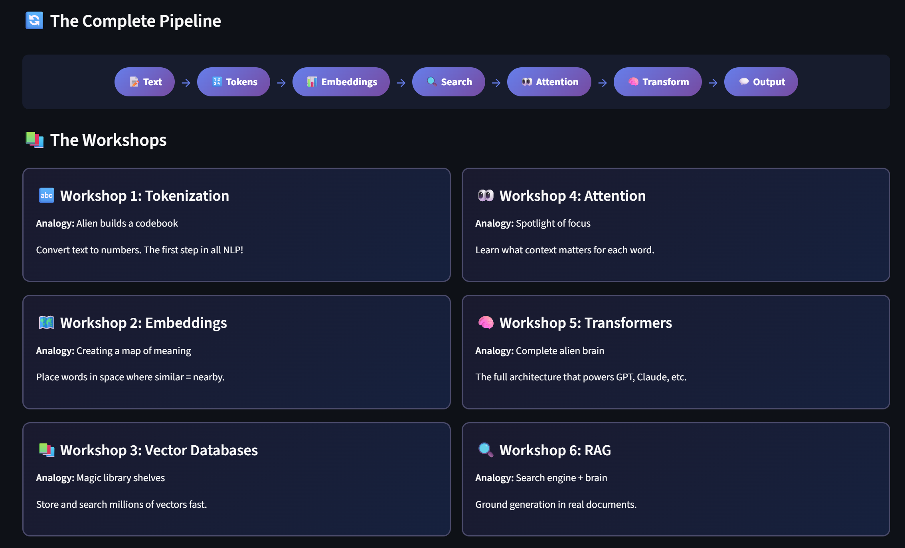
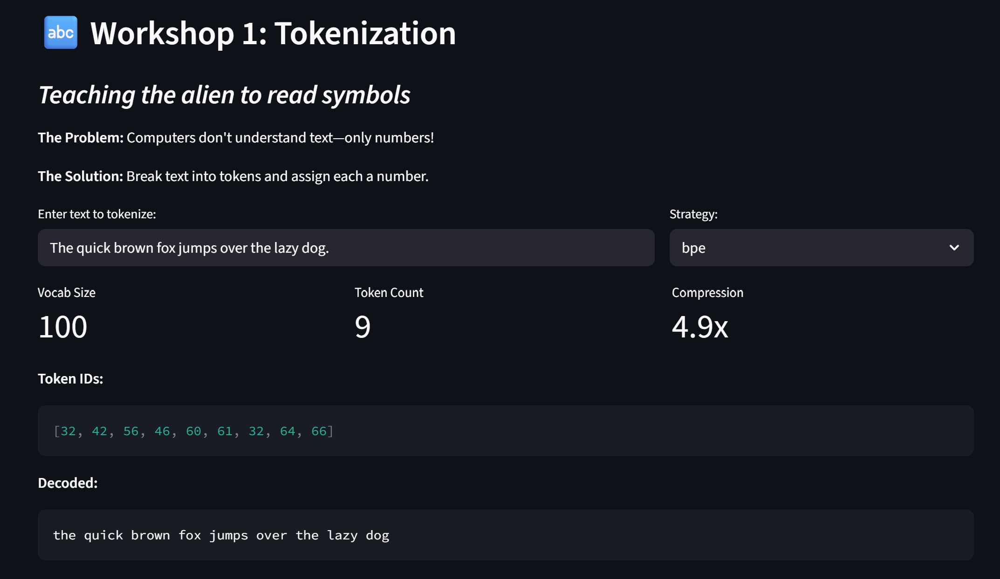
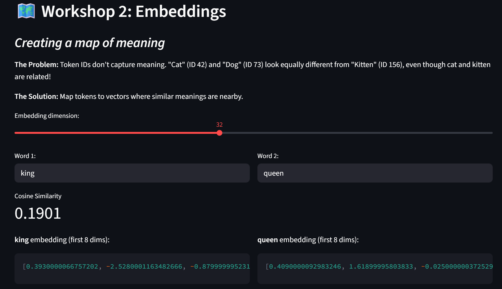
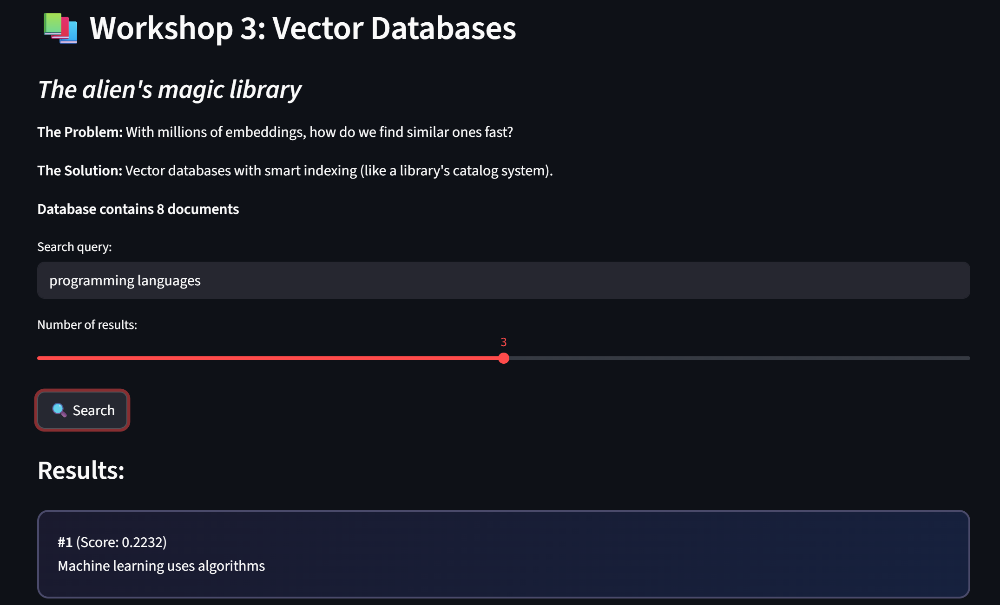
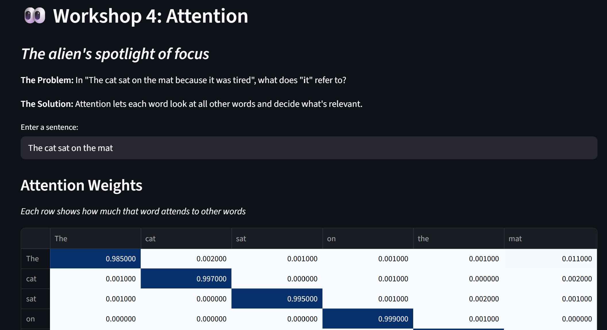
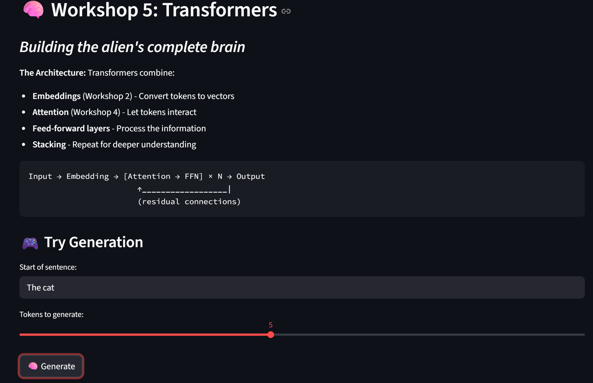
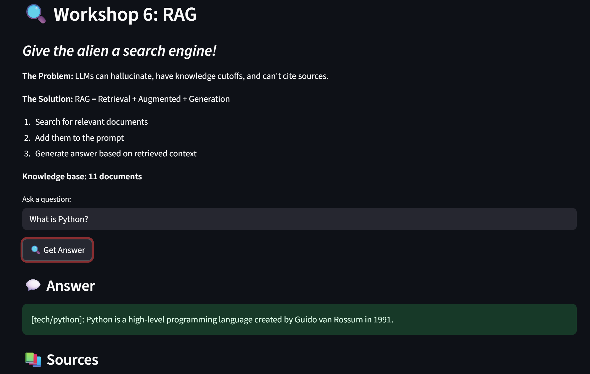

# 🎓 GenAI Self-Build: Teacher's Guide

A comprehensive guide for facilitators leading the GenAI Self-Build Workshop Series.

<p align="center">
  
</p>

---

## 📋 Table of Contents

1. [Series Overview](#series-overview)
2. [Preparation Checklist](#preparation-checklist)
3. [Workshop-by-Workshop Guide](#workshop-by-workshop-guide)
4. [Facilitation Tips](#facilitation-tips)
5. [Handling Different Skill Levels](#handling-different-skill-levels)
6. [Common Questions & Answers](#common-questions--answers)
7. [Technical Setup](#technical-setup)
8. [Assessment & Feedback](#assessment--feedback)

---

## 🎯 Series Overview

### Mission Statement

**Demystify Generative AI** by having participants build core components from scratch. Everything runs locally with lightweight, educational implementations.

### Format

- **6 workshops** × **1 hour each**
- **45 minutes** teaching/demo + **15 minutes** Q&A
- Designed for **developers and technical learners**
- **No ML/AI experience required**

### Learning Progression

```
┌─────────────────┐    ┌─────────────────┐    ┌─────────────────┐
│   WORKSHOP 1    │───▶│   WORKSHOP 2    │───▶│   WORKSHOP 3    │
│  Tokenization   │    │   Embeddings    │    │   Vector DBs    │
│  Text → Numbers │    │ Meaning → Space │    │ Semantic Search │
└─────────────────┘    └─────────────────┘    └─────────────────┘
                                                       │
┌─────────────────┐    ┌─────────────────┐    ┌───────▼─────────┐
│   WORKSHOP 6    │◀───│   WORKSHOP 5    │◀───│   WORKSHOP 4    │
│      RAG        │    │  Transformers   │    │    Attention    │
│ Retrieval+Gen   │    │   Full Model    │    │  Focus → Output │
└─────────────────┘    └─────────────────┘    └─────────────────┘
```

### Key Teaching Principles

1. **Analogy First** — Start with relatable concepts before code
2. **Build, Don't Import** — Implement from scratch, no magic libraries
3. **See It Work** — Interactive demos reinforce understanding
4. **Connect the Dots** — Each workshop references previous ones
5. **Demystify, Don't Overwhelm** — Simple implementations over production code

---

## ✅ Preparation Checklist

### 1 Week Before Series Starts

- [ ] Test all demos on presentation machine
- [ ] Review all slide decks in `workshops/*/slides/`
- [ ] Ensure Python 3.9+ installed
- [ ] Verify `pip install -r requirements.txt` works
- [ ] Test unified demo: `streamlit run app.py`
- [ ] Prepare backup cloud environment (Google Colab)
- [ ] Set up communication channel (Slack/Discord)

### Before Each Workshop

- [ ] Review the workshop's README.md and qna.md
- [ ] Run the tests: `python test_*.py`
- [ ] Launch the Streamlit demo and explore all tabs
- [ ] Prepare 2-3 discussion questions
- [ ] Have "checkpoint" code ready if participants fall behind

### Room/Environment Setup

- [ ] Projector/screen visible to all
- [ ] WiFi working and password shared
- [ ] Power outlets accessible
- [ ] Whiteboard/markers for ad-hoc diagrams
- [ ] Backup USB with code and slides

---

## 📚 Workshop-by-Workshop Guide

### Workshop 1: Tokenization — Text to Numbers



#### Learning Objectives
Participants will be able to:
- Explain why computers need text converted to numbers
- Implement character-level, word-level, and BPE tokenization
- Compare trade-offs between strategies

#### Session Timeline

| Time | Activity | Materials |
|------|----------|-----------|
| 0-5 | **Hook**: "How does ChatGPT read your message?" | Slide 1-2 |
| 5-15 | **Theory**: Three tokenization strategies | Slides 3-8 |
| 15-35 | **Demo**: Walk through `tokenizer.py` | Code + Streamlit |
| 35-45 | **Hands-on**: Participants try different inputs | Streamlit app |
| 45-60 | **Q&A** and preview of Workshop 2 | qna.md |

#### Key Points to Emphasize

1. **Character-level**: Simple but sequences get very long
2. **Word-level**: Intuitive but vocabulary explodes
3. **BPE**: The "goldilocks" — what GPT actually uses

#### Demo Script

```bash
# Launch the demo
cd workshops/01-tokenization
streamlit run app.py

# Show these examples:
# 1. "Hello World" - compare all three tokenizers
# 2. "antidisestablishmentarianism" - watch BPE handle it
# 3. "café" - special characters
# 4. "2+2=4" - why tokenization affects math
```

#### Common Participant Questions

| Question | Answer |
|----------|--------|
| "Why not just use characters?" | Sequences too long, no meaning captured |
| "How does BPE learn?" | Counts pair frequencies, merges most common |
| "What does ChatGPT use?" | BPE variant (tiktoken with ~100K tokens) |

---

### Workshop 2: Embeddings — Meaning in Math



#### Learning Objectives
Participants will be able to:
- Explain how meaning is captured in vectors
- Build embeddings using co-occurrence
- Visualize semantic relationships

#### Session Timeline

| Time | Activity | Materials |
|------|----------|-----------|
| 0-5 | **Hook**: "King - Man + Woman = Queen" | Slide 1-2 |
| 5-15 | **Theory**: Distributional semantics | Slides 3-8 |
| 15-35 | **Demo**: Walk through `embeddings.py` | Code + Streamlit |
| 35-45 | **Hands-on**: Find similar words, try analogies | Streamlit app |
| 45-60 | **Q&A** and connect to Workshop 1 | qna.md |

#### Key Points to Emphasize

1. **Words = Vectors**: Position in space = meaning
2. **Context Matters**: "You shall know a word by the company it keeps"
3. **Math on Meaning**: Vector arithmetic captures relationships

#### Demo Script

```bash
cd workshops/02-embeddings
streamlit run app.py

# Show these examples:
# 1. "cat" similar to "dog", "animal"
# 2. Analogy: "king" - "man" + "woman" = ?
# 3. Different strategies: random vs co-occurrence
```

---

### Workshop 3: Vector Databases — Semantic Memory



#### Learning Objectives
Participants will be able to:
- Explain semantic vs keyword search
- Build a vector store with LSH indexing
- Understand accuracy/speed tradeoffs

#### Session Timeline

| Time | Activity | Materials |
|------|----------|-----------|
| 0-5 | **Hook**: Search "happy dog" → find "joyful puppy" | Slide 1-2 |
| 5-15 | **Theory**: Vector search, ANN algorithms | Slides 3-8 |
| 15-35 | **Demo**: Walk through `vector_db.py` | Code + Streamlit |
| 35-45 | **Hands-on**: Add documents, search semantically | Streamlit app |
| 45-60 | **Q&A** and connect to embeddings | qna.md |

#### Key Points to Emphasize

1. **Semantic ≠ Keyword**: Meaning matters, not exact words
2. **Indexing**: Trade accuracy for speed
3. **This is RAG's Memory**: Foundation for Workshop 6

---

### Workshop 4: Attention — The Spotlight



#### Learning Objectives
Participants will be able to:
- Explain why attention replaced RNNs
- Implement self-attention with Q, K, V
- Visualize attention patterns

#### Session Timeline

| Time | Activity | Materials |
|------|----------|-----------|
| 0-5 | **Hook**: Show attention heatmap on sentence | Slide 1-2 |
| 5-15 | **Theory**: Q, K, V explained with analogy | Slides 3-8 |
| 15-35 | **Demo**: Walk through `attention.py` | Code + Streamlit |
| 35-45 | **Hands-on**: Visualize attention on different sentences | Streamlit app |
| 45-60 | **Q&A** and preview transformers | qna.md |

#### Key Points to Emphasize

1. **Soft Lookup**: Attention is searching for relevant info
2. **Query/Key/Value**: Like a database lookup
3. **Parallel**: Unlike RNNs, attention processes all at once

#### Key Analogy: The Library Analogy

> "Imagine you're in a library with a question (Query). You scan all book titles (Keys) to find relevant ones. Then you read those relevant books (Values). That's attention!"

---

### Workshop 5: Transformers — The Full Brain



#### Learning Objectives
Participants will be able to:
- Understand transformer architecture
- Build a mini decoder-only transformer
- See how text generation works

#### Session Timeline

| Time | Activity | Materials |
|------|----------|-----------|
| 0-5 | **Hook**: Generate text with the tiny model | Slide 1-2 |
| 5-15 | **Theory**: Architecture deep dive | Slides 3-8 |
| 15-35 | **Demo**: Walk through `transformer.py` | Code + Streamlit |
| 35-45 | **Hands-on**: Generate text, adjust temperature | Streamlit app |
| 45-60 | **Q&A** and set up for RAG | qna.md |

#### Key Points to Emphasize

1. **Building Blocks**: Attention + FFN + LayerNorm + Residuals
2. **Position Matters**: Positional encoding adds order
3. **Autoregressive**: Generate one token at a time

#### Important Caveat

> "Our tiny model generates gibberish — that's expected! The magic of GPT comes from:
> - Billions of parameters (we have thousands)
> - Trillions of tokens of training data
> - Weeks of GPU training
> 
> But the **architecture** is identical!"

---

### Workshop 6: RAG — Bringing It All Together



#### Learning Objectives
Participants will be able to:
- Understand the RAG pipeline
- Build a complete RAG system using previous workshops
- See how retrieval grounds generation

#### Session Timeline

| Time | Activity | Materials |
|------|----------|-----------|
| 0-5 | **Hook**: Ask question, get sourced answer | Slide 1-2 |
| 5-15 | **Theory**: RAG architecture | Slides 3-8 |
| 15-35 | **Demo**: Walk through `rag.py` | Code + Streamlit |
| 35-45 | **Hands-on**: Add documents, ask questions | Streamlit app |
| 45-60 | **Wrap-up**: Connect all workshops, celebrate! | qna.md |

#### Key Points to Emphasize

1. **Why RAG?**: Reduces hallucination, enables freshness
2. **The Pipeline**: Chunk → Embed → Store → Retrieve → Generate
3. **You Built This!**: Every component was from previous workshops

#### Grand Finale

Run the **End-to-End Pipeline** in the unified demo:
```bash
streamlit run app.py
# Navigate to "🔗 End-to-End Pipeline" tab
```

Show text flowing through: **Tokenization → Embedding → Vector Search → Attention → Generation**

---

## 🎭 Storytelling Tips

### Using Zara's Journey

The workshop series has a narrative protagonist — **Zara**, a Zorathian scientist who can't read human text. See `docs/STORY_GUIDE.md` for the complete narrative framework.

### Why Story Matters

- People retain **information embedded in stories far better** than isolated facts
- A character creates **emotional investment** in the technical content
- Narrative transitions make workshop connections **feel natural**
- Struggling alongside Zara **normalizes confusion** — even a genius alien finds this hard

### How to Use the Story

1. **Workshop 1 opening** (2 min): Introduce Zara — who she is, why she's here, what she can't do
2. **Each section**: Frame the challenge as Zara's problem before showing the solution
3. **Transitions**: Use the scripts from the Story Guide to bridge workshops
4. **Finale**: Read the closing passage — it ties everything back to the audience's own journey

### Quick Transition Scripts

| Between | Say This |
|---------|----------|
| 1 → 2 | *"Zara can read symbols now, but has no idea what they MEAN..."* |
| 2 → 3 | *"Millions of meaning vectors — she needs somewhere to put them..."* |
| 3 → 4 | *"She can find any document, but struggles with context..."* |
| 4 → 5 | *"Attention works — now she needs to assemble a complete brain..."* |
| 5 → 6 | *"The brain works, but makes things up. She needs a fact-checker..."* |

### Tips for Natural Delivery

- **Don't read scripts verbatim** — paraphrase in your own words
- **Use Zara's name** when framing challenges: "So Zara's next problem is..."
- **Let participants be Zara** — "If YOU were Zara, what would you try?"
- **Celebrate progress** — "Look what Zara (and you!) just built!"

---

## 🎓 Facilitation Tips

### Pacing

- **Watch the room**: If many look confused, slow down
- **Check-in questions**: "Does that make sense?" "Any questions so far?"
- **Time warnings**: "We have 10 minutes left for hands-on"

### Engagement Techniques

1. **Think-Pair-Share**: Pose a question, have them discuss with neighbor
2. **Predict First**: "What do you think will happen if..." before showing
3. **Live Debugging**: Intentionally make mistakes, fix together
4. **Call on Volunteers**: "Who wants to explain what just happened?"

### Energy Management

- **Start with energy**: Hook should be exciting
- **Mid-session break**: Quick stretch after theory
- **End strong**: Leave them wanting more

### Handling Questions

| Situation | Response |
|-----------|----------|
| Great question, on-topic | Answer it, credit the asker |
| Good question, tangent | "Great question! Let's cover that in Q&A" |
| Confused participant | "Let me show you another way to think about this..." |
| Advanced question | "Excellent! That's beyond our scope, but here's a resource..." |

---

## 🎚️ Handling Different Skill Levels

### For Faster Learners

- Point to extension exercises in READMEs
- Challenge: "Can you implement multi-head attention?"
- Suggest take-home projects
- Have them help neighbors

### For Those Who Struggle

- **Pair them up** with faster learners
- **Use checkpoint code** — pre-written solutions they can copy
- **Focus on concepts** over perfect code
- **Reassure**: "You don't need to understand every line"

### The 80/20 Rule

Aim for **80% of participants** to successfully:
- Run all demos
- Understand core concepts
- Complete basic exercises

The **other 20%** will either:
- Race ahead (give them extensions)
- Need extra help (pair programming, office hours)

---

## ❓ Common Questions & Answers

### Conceptual Questions

| Question | Answer |
|----------|--------|
| "Is this how ChatGPT actually works?" | Same architecture! Just 1000x bigger. |
| "Why build from scratch?" | To demystify. Libraries hide the magic. |
| "Will this make me an AI expert?" | It'll give you mental models to understand AI deeply. |

### Technical Questions

| Question | Answer |
|----------|--------|
| "Why NumPy only?" | To see every step. PyTorch adds layers of abstraction. |
| "Is this production-ready?" | No! It's educational. Use sentence-transformers, FAISS, etc. in prod. |
| "How do I learn more?" | See resources in USER_GUIDE.md |

### "How does ChatGPT..." Questions

| Question | Answer |
|----------|--------|
| "...remember conversation?" | Chat history is prepended to each prompt |
| "...know so much?" | Trained on trillions of tokens from the internet |
| "...sometimes hallucinate?" | It's predicting likely tokens, not retrieving facts (hence RAG!) |

---

## 💻 Technical Setup

### Minimum Requirements

- Python 3.9+
- 4GB RAM
- Any CPU (no GPU needed)

### Dependencies

```bash
pip install numpy>=1.21.0 streamlit>=1.28.0
```

### Backup Plans

1. **Google Colab notebooks** — Pre-prepared, runs in browser
2. **Pre-recorded demos** — If live coding fails
3. **USB drive** — Offline copy of all materials
4. **Pair programming** — Working machine shared with neighbor

### Testing Before Sessions

```bash
# Run all tests
cd workshops/01-tokenization && python test_tokenizer.py
cd ../02-embeddings && python test_embeddings.py
cd ../03-vector-databases && python test_vector_db.py
cd ../04-attention && python test_attention.py
cd ../05-transformers && python test_transformer.py
cd ../06-rag && python test_rag.py

# Run unified demo
cd ../..
streamlit run app.py
```

---

## 📊 Assessment & Feedback

### In-Session Checks

- **Thumbs up/down** after each section
- **Quick polls**: "Who got the demo running?"
- **Live questions** during Q&A

### Post-Workshop Survey (Suggested Questions)

1. How would you rate today's workshop? (1-5)
2. What was the most valuable thing you learned?
3. What was confusing or could be explained better?
4. Would you recommend this to a colleague?
5. What topics would you like to see in future workshops?

### Success Metrics

| Metric | Target |
|--------|--------|
| Completion rate | >80% |
| Code runs | >90% of participants |
| Can explain concept | >75% |
| Would recommend | >80% |

### Collecting Feedback

- **End of each session**: Quick 2-question survey
- **End of series**: Comprehensive survey
- **Office hours**: Open Q&A for deeper discussions

---

## 📁 Materials Reference

### Folder Structure

```
workshops/
├── 01-tokenization/
│   ├── tokenizer.py       # Core implementation
│   ├── app.py             # Streamlit demo
│   ├── test_tokenizer.py  # Tests
│   ├── README.md          # Overview
│   ├── cheatsheet.md      # Quick reference
│   ├── qna.md             # Q&A
│   └── slides/slides.md   # Marp presentation
├── 02-embeddings/
├── 03-vector-databases/
├── 04-attention/
├── 05-transformers/
└── 06-rag/
```

### Key Files for Teachers

| Purpose | File |
|---------|------|
| This guide | `docs/TEACHER_GUIDE.md` |
| **Story guide** | **`docs/STORY_GUIDE.md`** |
| User guide | `docs/USER_GUIDE.md` |
| Workshop plan | `docs/workshop-plan.md` |
| Style guide | `.github/copilot-instructions.md` |
| Unified demo | `app.py` |

---

## 🎉 Final Notes

### The Goal

By the end of this series, participants should be able to:

1. **Explain** each component of a GenAI system to a colleague
2. **Read** transformer-related code without being intimidated
3. **Build** simple AI-powered applications
4. **Evaluate** AI tools with an informed perspective

### Your Role as Facilitator

You're not just teaching code — you're **demystifying** something that feels like magic. Your enthusiasm and patience will determine how empowered participants feel.

### Thank You!

Thank you for facilitating this series. You're helping people understand one of the most transformative technologies of our time.

---

*Questions? Contact: michael.kennedy@analog.com*

*Last Updated: December 2025*
