<!-- _paginate: false -->
<!-- _backgroundColor: #000000 -->

# 🛸 Zara Crash-Lands in Shape World

### An alien learns to see — and accidentally explains GenAI

 

**Michael Kennedy** · Analog Layout Conference
michael.kennedy@analog.com

<!--
SPEAKER NOTES:
Welcome everyone. Before we start — I want you to do something weird.
Close your eyes for three seconds. Ready? Close them. … Now open.
That moment of opening — that flood of visual information — that's what today is about.
-->

---

<!-- _backgroundColor: #000000 -->
<!-- _color: #60a5fa -->

# A World of Pure Sound

### 〰️ ))) ≋ ⚡ ))) 〰️

 

*No edges. No corners. No color. Just vibrations.*

<!--
SPEAKER NOTES:
Imagine you've never seen a shape. Not a circle. Not a square. Not a line.
You come from a world of pure sound.
You perceive the universe through vibrations, frequencies, echoes.
Really sit with this. You're brilliant. A scientist. But you have zero concept of edges, corners, or color. Now imagine you crash-land on Earth…
-->

---

<!-- _backgroundColor: #0f172a -->

# You open your eyes for the first time.

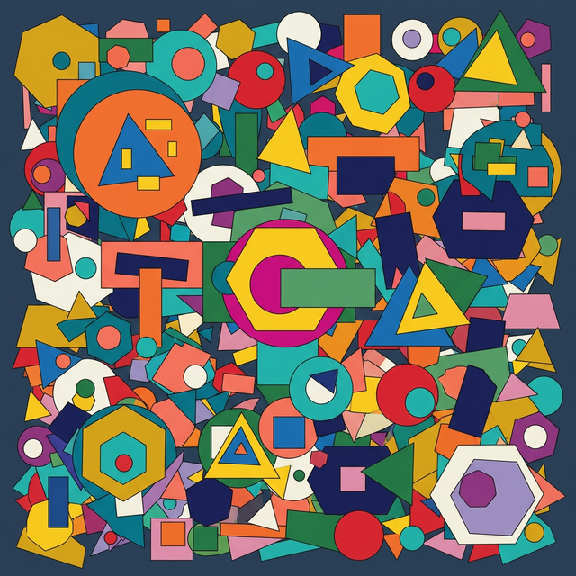

And you see… **this**.

<!--
SPEAKER NOTES:
[REPLACE placeholder with actual chaotic shape collage]
Every pixel. Every color. Every edge. All at once. Pure visual noise.
-->

---

# Meet Zara 🛸

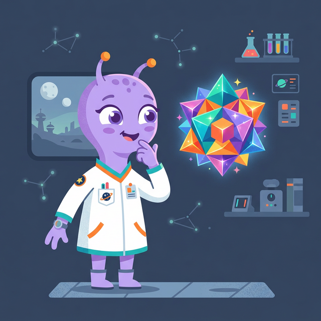

- Alien scientist from Zorath-7
- World of pure sound — she "sees" with echolocation
- Crash-landed on Earth
- Has to learn what shapes are from scratch

> She's about to go on the **exact same journey** that every AI goes on when we teach it to understand images.

<!--
SPEAKER NOTES:
Zara is our guide. Her confusion is real — it's exactly the confusion a neural network faces when you feed it raw pixel data for the first time.
-->

---

<!-- _class: lead -->

# Act 1

## 🧩 "What Am I Looking At?"

*Breaking the visual chaos into manageable pieces*

---

# Attempt 1: Look at every pixel

<!--
SPEAKER NOTES:
Zara's first problem: overwhelm. There's TOO MUCH to look at. 
She needs to break what she sees into manageable pieces.
Attempt 1: Look at every pixel at a time. It's a grid of tiny color values.
Like trying to understand a song by listening to one air molecule vibrating at a time.
Result: 100 tokens for a simple house. Technically complete. Practically useless.
-->

---

# Attempt 2: Memorize whole shapes

> "That's a circle! That's a rectangle!"

Works great… until she sees something new.

---

# Attempt 3: Learn the PARTS 🧩

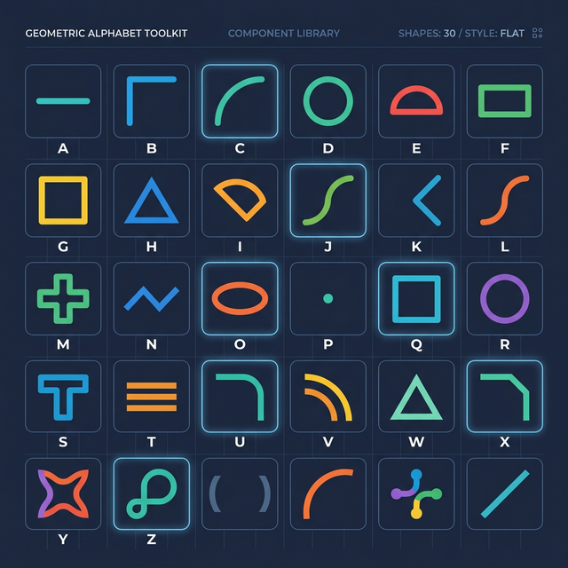

<!--
SPEAKER NOTES:
Attempt 3: Learn the PARTS.
Corners repeat. Edges repeat. Curves repeat. Build an alphabet of shape-parts.
Describe ANY shape as a combination of known parts.
Like BPE in text — "un" + "break" + "able" covers words you've never seen.
Result: 12 tokens — flexible, efficient, handles novelty.
-->

---

# This is tokenization.

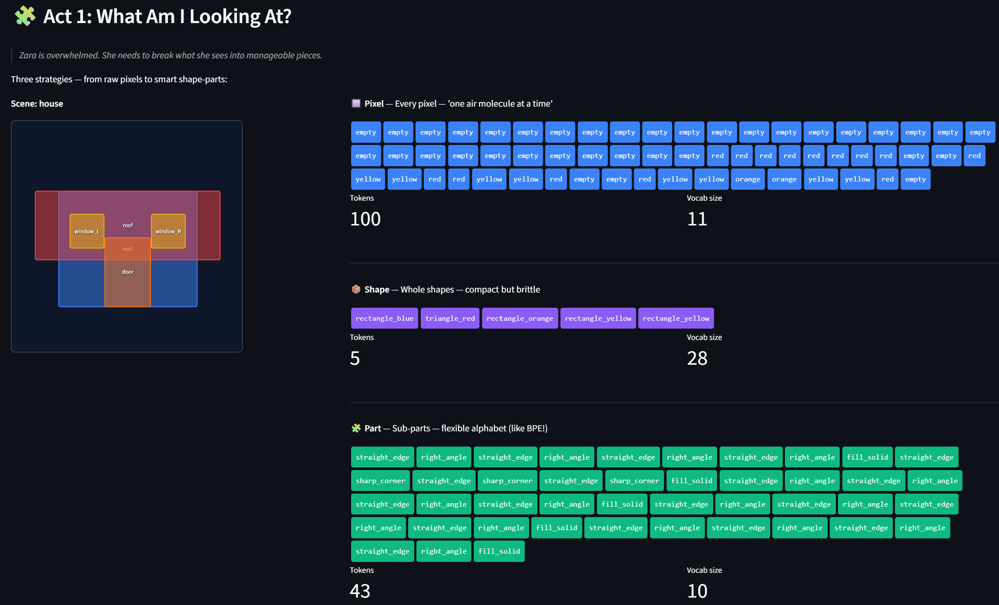

<!--
SPEAKER NOTES:
[DEMO MOMENT — switch to Streamlit Tab 1: Shape Tokenizer]
Let me show you this live…
When you upload a photo to ChatGPT, it gets chopped into 16×16 patches.
Each patch becomes a token. That's ViT tokenization.
-->

---

<!-- _class: lead -->

# Act 2

## 🗺️ "Do These Go Together?"

*Turning shapes into meaning — and meaning into distance*

---

# The number problem

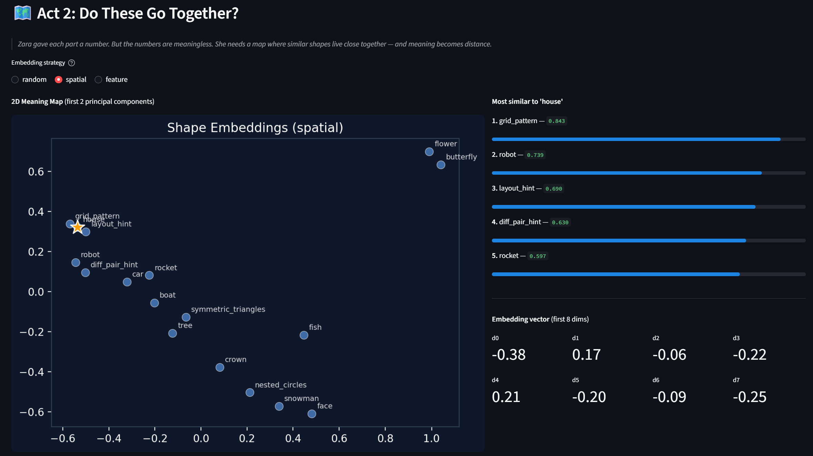

<!--
SPEAKER NOTES:
Zara gave each part a number. Edge-type-42. Edge-type-43.
But a sharp corner and a gentle curve are one number apart. The numbers are meaningless.
So she builds a map where similar shapes live close together and different shapes live far apart.
The map captures relationships!
-->

> If `triangle + rectangle = house`…
> then `dome + rectangle ≈ mosque`
>
> The **direction** between shapes has meaning.

---

# This is what AI calls "embeddings"

Every shape becomes a **point in space**.

**Meaning = distance.**

<!--
SPEAKER NOTES:
[DEMO MOMENT — switch to Streamlit Tab 2: Meaning Map]
Watch how similar scenes cluster together…
[REPLACE placeholder with actual scatter plot screenshot]
-->

---

# 📚 The Shape Library

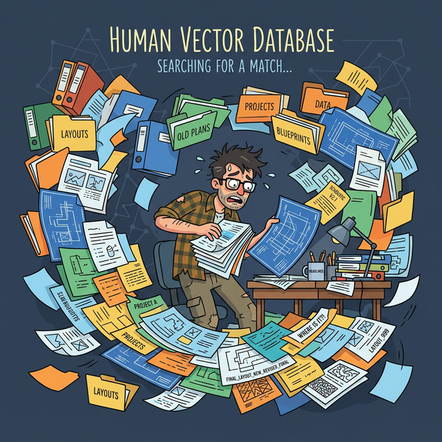

<!--
SPEAKER NOTES:
Zara has collected thousands of shape arrangements.
When she sees something new, she wants to ask: "Have I seen something like this before?"
She needs a library where you search by similarity, not by name.
Pick a query -> find the nearest neighbors by vector distance.
Quick audience check: raise your hand if you've ever flipped through old tape-outs looking for something "kind of like" what you're working on now.
Congratulations — you're a human vector database.
-->

Pick a query → find the nearest neighbors by vector distance.

> This is a **vector database**.
>
> Google Photos, Spotify recommendations, and semantic code search all use this.

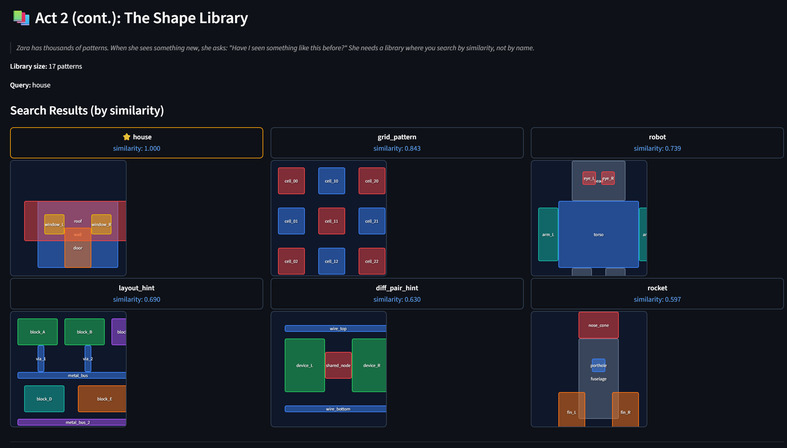

<!--
SPEAKER NOTES:
[DEMO MOMENT — switch to Streamlit Tab 3: Shape Library]
Let's search for scenes similar to "house"…
This is a vector database. Google Photos, Spotify recommendations, and semantic code search all use this.
-->

---

<!-- _class: lead -->

# Act 3

## 👀 "Wait, Context Matters!"

*Learning which shapes relate to each other*

---

# The context problem

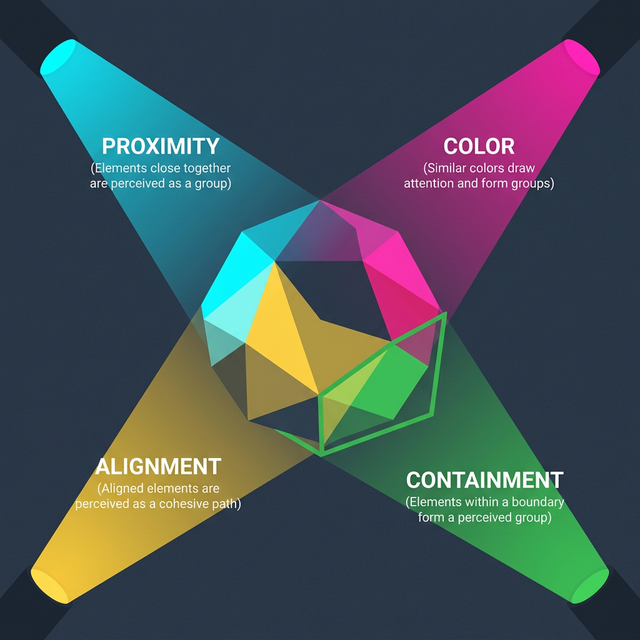

<!--
SPEAKER NOTES:
Zara sees a red circle. She treats it the same whether it's on a traffic light or a clown's nose.
Same shape. Very different meaning.
She needs to learn: what's around it matters.
The spotlight system: Every shape shines a spotlight on every other shape and asks: "Are you important to me?"
Four spotlights, each looking for a different relationship: Proximity, Color Match, Alignment, Containment.
-->

---

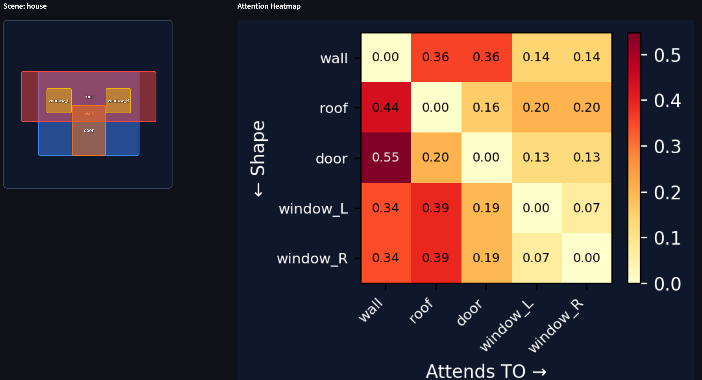

<!--
SPEAKER NOTES:
[DEMO MOMENT — switch to Streamlit Tab 4: Attention Heatmap]
Toggle between heads to see different relationship types…
When Zara looks at a house:
The roof attends strongly to the walls (proximity + alignment)
The windows attend to each other (color match)
The door attends to the wall it sits in (containment)
This is multi-head self-attention — the breakthrough from 2017.
-->

---

# Can I CREATE something new?

Zara stacks all her tools into one system:

**Tokenize → Embed → Search → Attend → Predict next shape**

> One shape at a time. Like writing a sentence word by word.

Her first attempt is… not great.

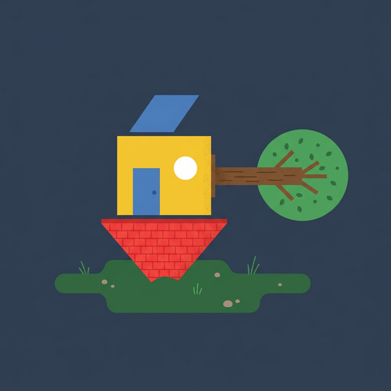

**[pause for laughs]**

---

# Same architecture. Different scale.

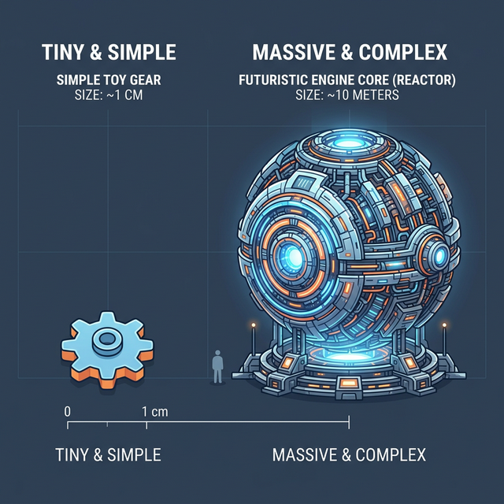

<!--
SPEAKER NOTES:
Zara's toy: ~10,000 parameters. Amusing.
DALL-E 3: ~3 billion. Impressive.
GPT-4V: ~1.8 trillion. Mind-blowing.
The engine is the same.
The horsepower is enormously different.
-->

---

<!-- _class: lead -->

# Act 4

## 🔍 "Check Your Work"

*Knowing when to look things up*

---

# The hallucination problem

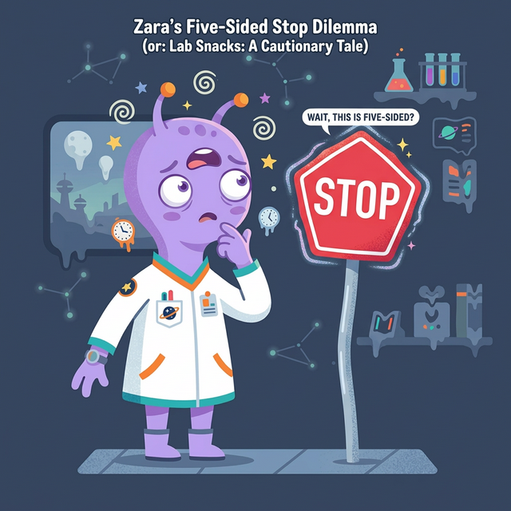

Zara's generator sometimes creates nonsense.
A five-sided stop sign. A face with the mouth above the eyes.

Her solution is **brilliantly humble**:

> Before creating something new, **LOOK at what already exists.**
> Search the library. Pull up similar examples. Use them as a guide. THEN generate.

---

# This is RAG

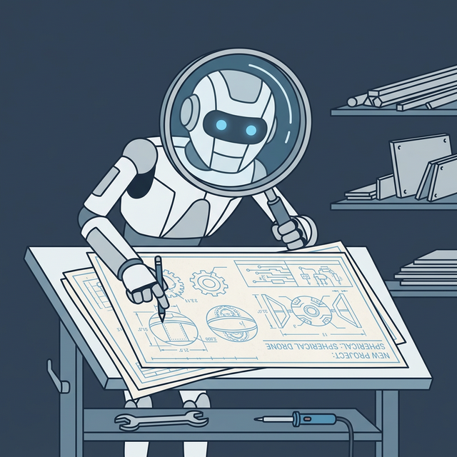

<!--
SPEAKER NOTES:
This is RAG: Retrieval-Augmented Generation
Request -> Search library -> Retrieve examples -> Generate (guided) -> Output
It's why ChatGPT can answer questions about today's news even though it was trained months ago. It looks things up first.
And it's why AI for YOUR world doesn't have to hallucinate layouts from scratch.
-->

---

<!-- _class: lead -->

# The Reveal

## "Sound Familiar?"

---

# Zara's complete journey

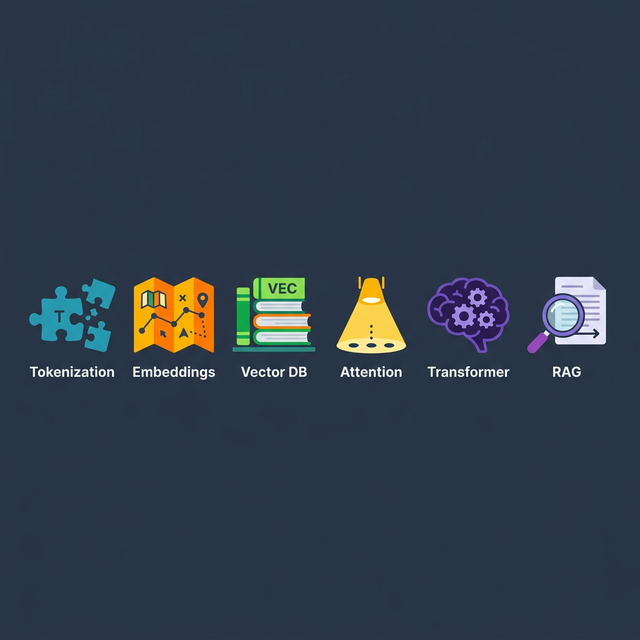

1. **Break images into pieces** (Tokenization)
2. **Map meaning into space** (Embeddings)
3. **Build a searchable library** (Vector Database)
4. **Learn relationships** (Attention)
5. **Generate new shapes** (Transformers)
6. **Check your work** (RAG)

---

# Now replace "shapes" with…

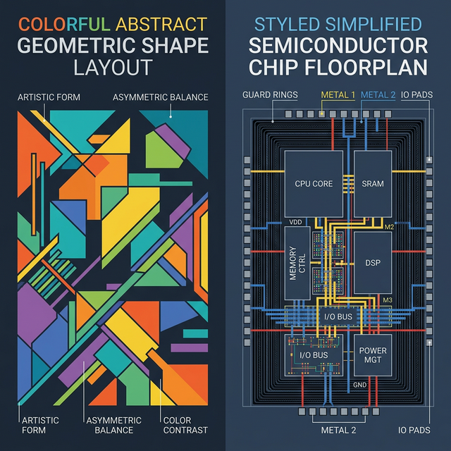

- **Shapes** → Polygons on metal layers
- **Arrangements** → Layout floorplans
- **Library** → Your corporate IP database
- **Parts** → Standard cell primitives

> The math is **identical**.
> The concepts are **identical**.
> The only difference is what the shapes represent.

---

# This is already happening.

| Who | What |
|-----|------|
| **Google** | RL + ML for TPU chip floorplanning *(Nature, 2021)* |
| **Cadence** | ML-assisted placement in Virtuoso |
| **Synopsys** | ML constraint extraction in Custom Compiler |
| **ALIGN (DARPA)** | Analog layout from netlists |
| **MAGICAL (UT Austin)** | Automated analog layout generation |

> It's not science fiction. It's happening **now**.

---

<!-- _class: lead -->

# "Your Copilot, Not Your Replacement"

---

# The last 20%

<!--
SPEAKER NOTES:
Zara learned to see patterns. But she never learned taste.
She doesn't know why you put those guard rings there. She doesn't have twenty years of tribal knowledge about what works at your foundry.
AI is the most talented intern you've ever had. It remembers every layout. It searches in milliseconds. It suggests first-pass placement.
The last 20% is you. That's the art. That's not going anywhere.
-->

---

# Three takeaways

1. **AI learns to see shapes the same way it learns to read text**
   Break it apart → map meaning → search → attend → generate → verify

2. **This is already happening in chip design**
   Google, Cadence, Synopsys, ALIGN, MAGICAL

3. **AI is your copilot, not your replacement**
   Patterns are learnable. Taste is not.

---

<!-- _backgroundColor: #000000 -->
<!-- _paginate: false -->

# 🛸 Thank you!

**Zara went from not knowing what a shape was…
to being able to generate and verify arrangements.**

That's the GenAI journey, in twenty minutes.

 

**Michael Kennedy**
michael.kennedy@analog.com

*Full 6-workshop deep-dive series:*
*github.com/your-repo/genai-self-build*

<!--
SPEAKER NOTES:
Thank you. I'm happy to take questions. And if you want to go deeper on any of these concepts, I have a full 6-part workshop series — each concept gets its own hands-on lab. The link is on screen.
-->
