<!-- _paginate: false -->
<!-- _class: dark -->

    

<!-- 
SLIDE 1 — BLACK SCREEN
"Close your eyes..."
Hold for 5 seconds of silence.
-->

---

<!-- _paginate: false -->
<!-- _class: closing -->

# 🛸 Zara Crash-Lands in Shape World

## An alien learns to see — and accidentally explains GenAI

 

**Michael Kennedy** · Analog Layout Conference

*michael.kennedy@analog.com*

<!-- 
SLIDE 2 — TITLE
"Now — open."
Reveal title. Hit the audience with the premise.
-->

---

<!-- _class: dark -->

# A World of Pure Sound

 

### 〰️&nbsp;&nbsp;)))&nbsp;&nbsp;≋&nbsp;&nbsp;⚡&nbsp;&nbsp;)))&nbsp;&nbsp;〰️

 

*No edges. No corners. No colour.*
*Just vibrations, frequencies, echoes.*

<!-- 
SLIDE 3 — SOUND WORLD
Set the scene. Zara's species evolved in permanent darkness.
They're brilliant scientists — but have zero concept of vision.
-->

---

# You open your eyes for the first time.

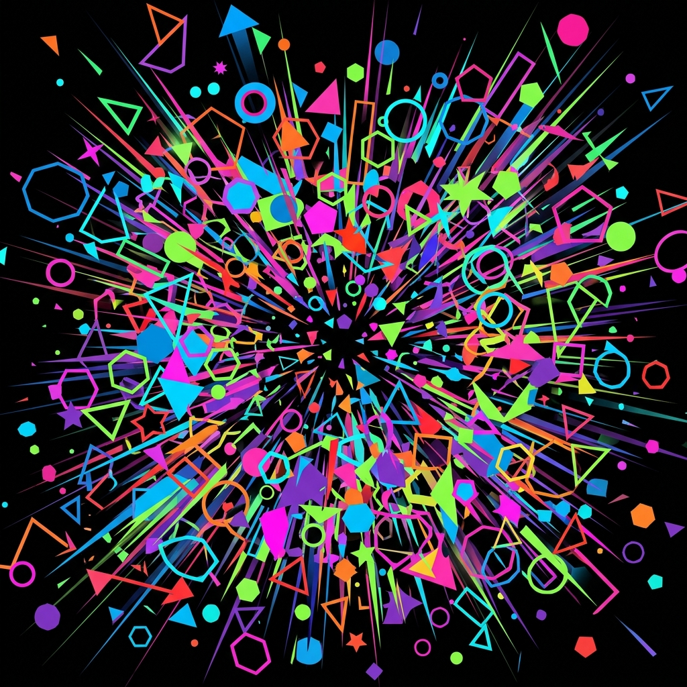

And you see… **this**.

*Every pixel. Every colour. Every edge.*
*All at once. Pure visual noise.*

<!-- 
SLIDE 4 — VISUAL CHAOS
Pause here. Let the audience sit with the overwhelm.
"It's like trying to understand a symphony by hearing every instrument,
every note, every harmonic simultaneously."
-->

---

# Meet Zara 🛸

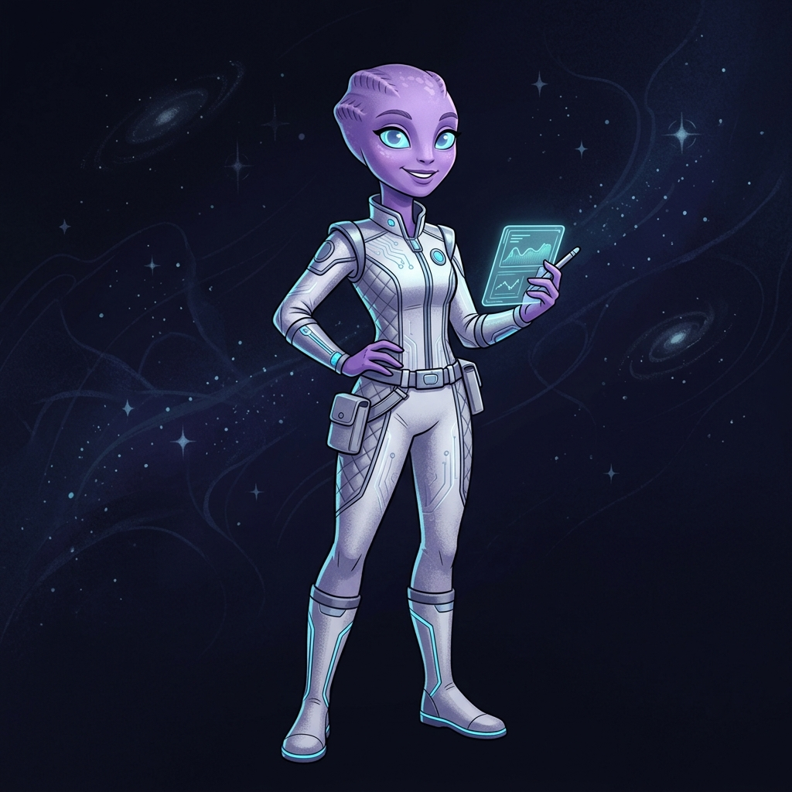

- Alien scientist from **Zorath-7**
- World of pure sound — sees with echolocation
- Crash-landed on Earth
- Must learn what shapes are **from scratch**

> She's about to go on the **exact same journey** that every AI goes on when we teach it to understand images.

<!-- 
SLIDE 5 — INTRODUCE ZARA
"Her confusion is real. It's exactly the confusion a neural network faces
when you feed it raw pixel data for the first time."
-->

---

<!-- _class: act -->

# Act 1

## 🧩 "What Am I Looking At?"

*Breaking the visual chaos into manageable pieces*

<!-- 
SLIDE 6 — ACT 1 TITLE
Three attempts at understanding.
-->

---

# Attempt 1: Every Pixel

A grid of tiny colour values. One at a time.

*100 tokens for a simple house shape.*

> Like trying to understand a song by measuring one air molecule's vibration at a time. Technically complete. Practically useless.

<!-- 
SLIDE 7 — PIXEL APPROACH
Draw the analogy to the sound world she knows.
-->

---

# Attempt 2: Memorise Whole Shapes

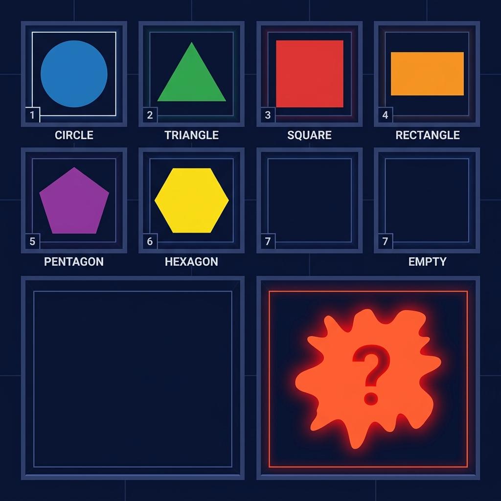

> "That's a circle! That's a rectangle!"

Works beautifully — until she sees something new.

*"What IS that?! It's not in my catalogue!"*

**"DOES NOT COMPUTE!"**

<!-- 
SLIDE 8 — MEMORISE APPROACH
Commit to the panicked Zara voice. The audience will love it.
-->

---

# Attempt 3: Learn the PARTS 🧩

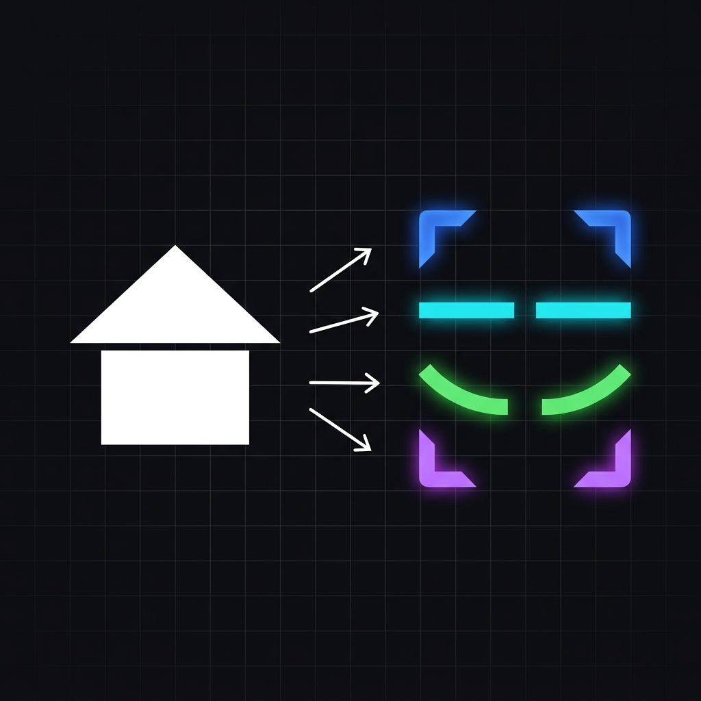

**Corners** repeat. **Edges** repeat. **Curves** repeat.

She builds an **alphabet of shape-parts**.

Now she can describe *any* shape — even brand-new ones — as a combination of parts she already knows.

| Approach | Tokens | Handles novelty? |
|----------|--------|-------------------|
| Every pixel | 100 | ✅ but useless |
| Whole shapes | 3 | ❌ fragile |
| **Shape parts** | **12** | **✅ flexible** |

<!-- 
SLIDE 9 — PARTS APPROACH (THE BREAKTHROUGH)
This is the "aha" — the balance between granularity and abstraction.
-->

---

<!-- _class: impact -->

# This is tokenization.

*When you upload a photo to ChatGPT, it gets chopped into 16×16 patches.*
*Each patch becomes a token — a "shape word."*

*"Unbreakable" → "un" + "break" + "able"*
*Three known parts. Infinite combinations.*

<!-- 
SLIDE 10 — TOKENIZATION REVEAL
Connect Zara's journey to what ChatGPT actually does.
The text analogy (BPE) reinforces the concept.
-->

---

<!-- _class: act -->

# Act 2

## 🗺️ "Do These Go Together?"

*Turning shapes into meaning — and meaning into distance*

<!-- 
SLIDE 11 — ACT 2 TITLE
Transition from structure to semantics.
-->

---

# The Number Problem

Zara assigned each part a number.
**Edge-type-42.** **Edge-type-43.**

But a sharp corner and a gentle curve are **one number apart**.

The numbers are **meaningless**.

She needs a way to capture that some shapes are **similar** and others are **different**.

<!-- 
SLIDE 12 — THE NUMBER PROBLEM
Set up why simple indexing doesn't work.
-->

---

# The Meaning Map

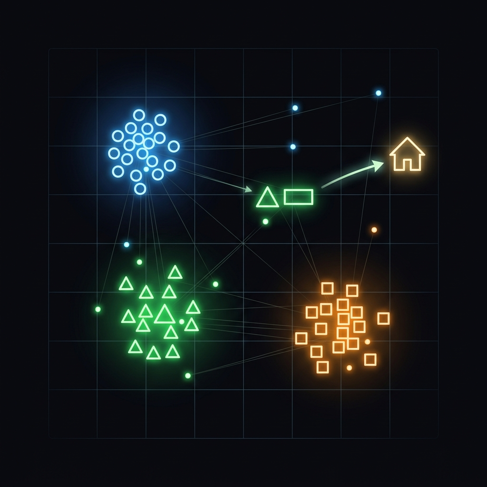

Similar shapes live **close together**.
Different shapes live **far apart**.

And the magical part —

> **The *direction* between shapes has meaning.**
>
> `triangle + rectangle = house`
> `dome + rectangle ≈ mosque`

The map captures **relationships**.

<!-- 
SLIDE 13 — MEANING MAP / EMBEDDINGS
Lean in when you say "the direction between shapes has meaning."
This is the intellectual hook of Act 2.
-->

---

<!-- _class: impact -->

# This is what AI calls "embeddings"

Every shape becomes a **point in space**.

**Meaning = distance.**

<!-- 
SLIDE 14 — EMBEDDINGS REVEAL
Big simple statement. Let it land.
Beat. Move on.
-->

---

# The Shape Library 📚

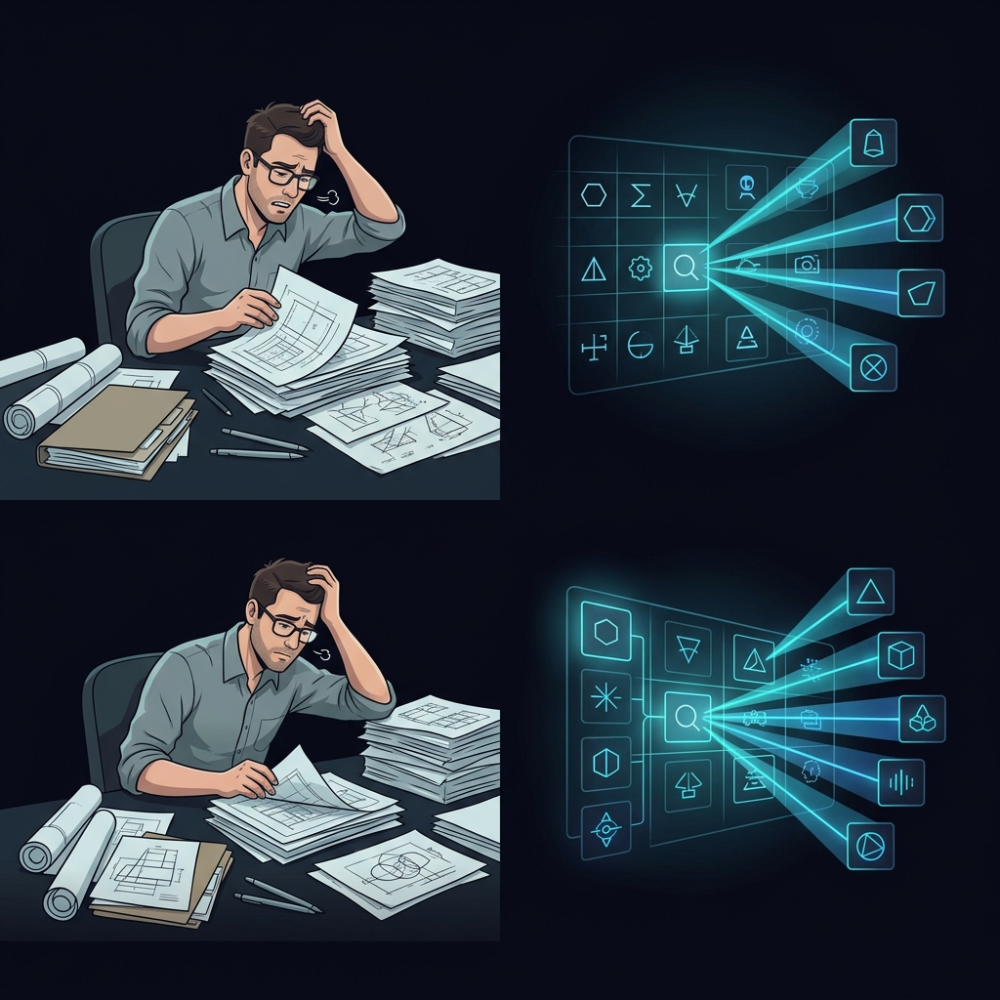

Zara has **thousands** of shape arrangements.

When she sees something new:
*"Have I seen something **like** this before?"*

She needs a library where you search
by **similarity**, not by name.

<!-- 
SLIDE 15 — VECTOR DB CONCEPT
Set up the "human vector database" joke.
-->

---

# Search by Similarity

Drop in a query → find the **nearest neighbours**.

> **Google Photos** groups your faces → vector database
> **Spotify** "Discover Weekly" → vector database
> **GitHub** code search → vector database

<!-- 
SLIDE 16 — VECTOR DB IN PRACTICE
"Raise your hand if you've ever flipped through old tape-outs
looking for something 'kind of like' what you're working on now."

"Congratulations — you're a human vector database."

BIGGEST LAUGH — don't talk over it.
-->

---

<!-- _class: act -->

# Act 3

## 👀 "Wait, Context Matters!"

*Learning which shapes relate to each other*

<!-- 
SLIDE 17 — ACT 3 TITLE
-->

---

# The Context Problem

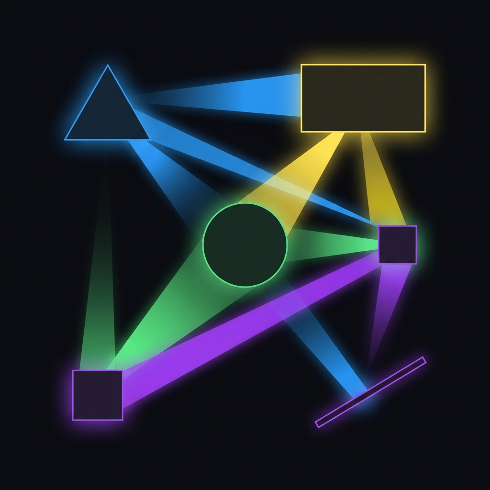

Zara sees a **red circle**.

She calls it "red circle" — whether it's on a **traffic light** or a **clown's nose**.

Same shape. **Completely different meaning.**

She doesn't understand that what's *around* a shape changes what the shape *means*.

<!-- 
SLIDE 18 — CONTEXT PROBLEM
"Isolation is where meaning goes to die."
-->

---

# The Spotlight System 🔦

Every shape shines a spotlight on every other shape:
**"Are you important to me?"**

Four spotlights, each seeking a different relationship:

| Spotlight | Asks |
|-----------|------|
| 🔵 **Proximity** | "Are you close to me?" |
| 🟡 **Colour** | "Do we look alike?" |
| 🟢 **Alignment** | "Are we lined up?" |
| 🟣 **Containment** | "Am I inside you?" |

Combined, they see **everything**.

<!-- 
SLIDE 19 — SPOTLIGHT SYSTEM / ATTENTION MECHANISM
Each spotlight = one attention head.
-->

---

# Multi-Head Attention

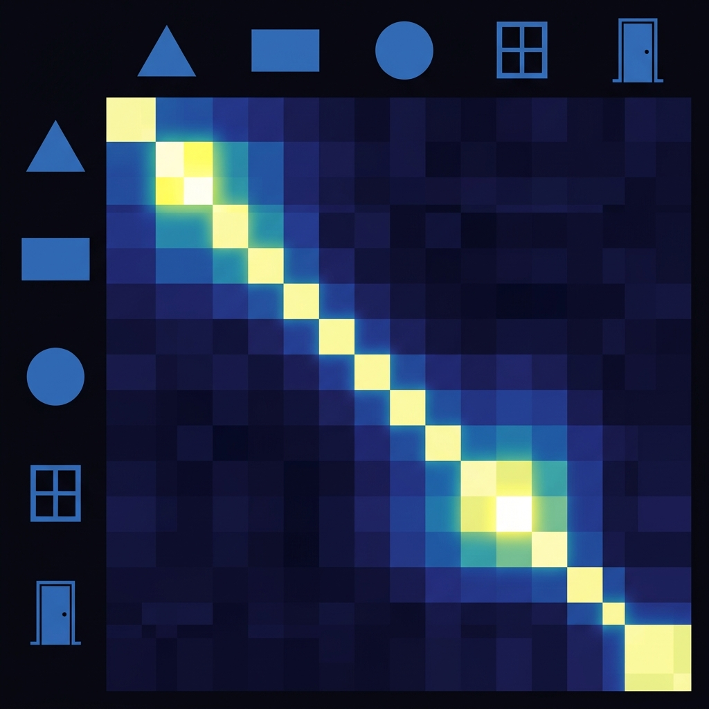

*Triangle on rectangle → the alignment head goes crazy.*
*Matching triangles → proximity + colour both fire.*
*Windows in walls → containment lights up.*

<!-- 
SLIDE 20 — ATTENTION HEATMAP
"This is the breakthrough from 2017 — 'Attention Is All You Need.'"
-->

---

<!-- _class: impact -->

# This is attention.

*How ChatGPT knows that "it" in*
*"The cat sat on the mat because **it** was tired"*
*refers to the **cat**, not the mat.*

*Every word shines a spotlight on every other word.*

<!-- 
SLIDE 21 — ATTENTION REVEAL
Slow down here. This is the core concept.
-->

---

# Can I CREATE something new?

Zara stacks all her tools into one system:

**Tokenize → Embed → Search → Attend → Predict next shape**

> One shape at a time. Like writing a sentence word by word.

Her first attempt is… *not great*.

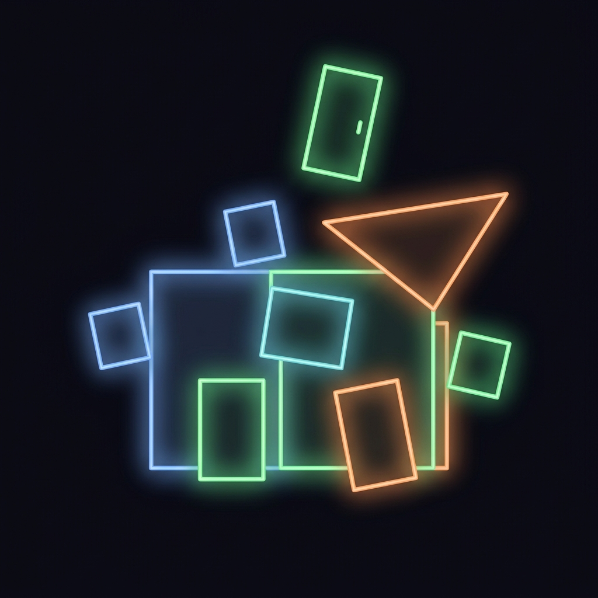

<!-- 
SLIDE 22 — GENERATION ATTEMPT
Pause for laughs at the bad house.
"But the architecture — the architecture is RIGHT."
-->

---

# Same Engine. Different Scale.

| Model | Parameters |
|-------|-----------|
| Zara's toy | ~10,000 |
| DALL-E 3 | ~3 billion |
| GPT-4 | ~1.8 trillion |

> Like comparing a **go-kart** to a **Formula One** car.
> Same physics. Very different lap times.

<!-- 
SLIDE 23 — SCALE
The go-kart / F1 analogy makes the scale visceral.
-->

---

<!-- _class: act -->

# Act 4

## 🔍 "Check Your Work"

*Knowing when to look things up*

<!-- 
SLIDE 24 — ACT 4 TITLE
-->

---

# The Hallucination Problem

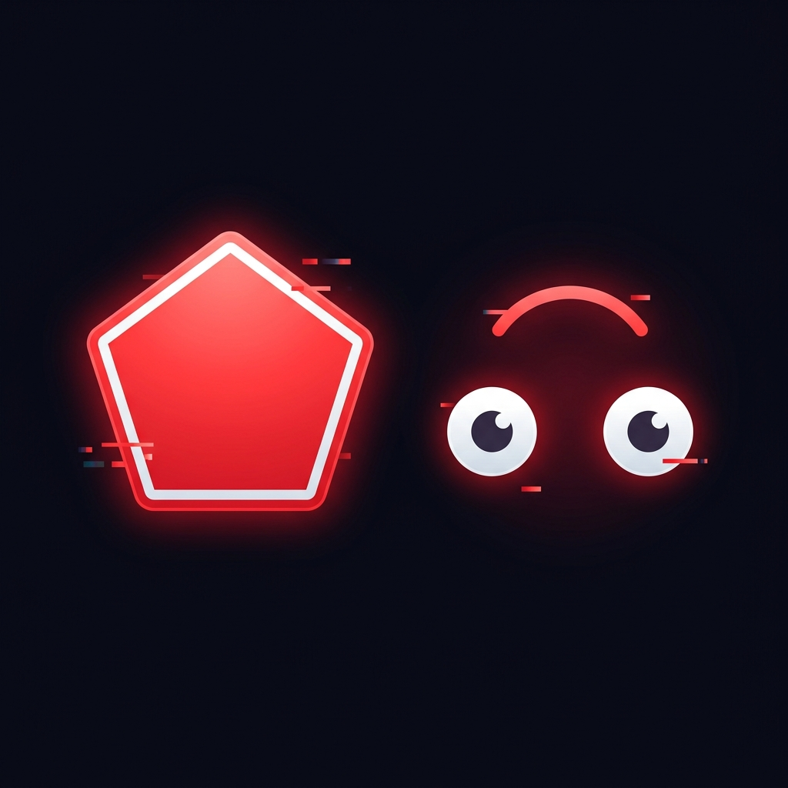

Zara's generator sometimes creates **nonsense**.

A five-sided stop sign.
A face with the mouth above the eyes.

It looks *plausible* — until you actually look at it.

> Like a student who studied hard but didn't bring their notes to the exam.

<!-- 
SLIDE 25 — HALLUCINATIONS
The exam analogy makes hallucination intuitive.
-->

---

# Look Before You Create

Zara's solution is **brilliantly humble**:

1. **Search** the library
2. **Retrieve** similar examples
3. Use them as a **guide**
4. *Then* **generate**

> Don't trust your memory alone. **Check your work.**

<!-- 
SLIDE 26 — RAG PIPELINE
"It can search your proven designs — layouts that passed DRC,
that survived LVS, that taped out successfully."
-->

---

<!-- _class: impact -->

# This is RAG.

**Retrieval-Augmented Generation**

*It's why ChatGPT can answer questions about today's news*
*even though its training data is months old.*

*It looks things up first.*

<!-- 
SLIDE 27 — RAG REVEAL
-->

---

<!-- _class: act -->

# The Reveal

## 🪞 "Sound Familiar?"

<!-- 
SLIDE 28 — REVEAL TITLE
Move to centre stage. Slow down.
-->

---

# Zara's Complete Journey

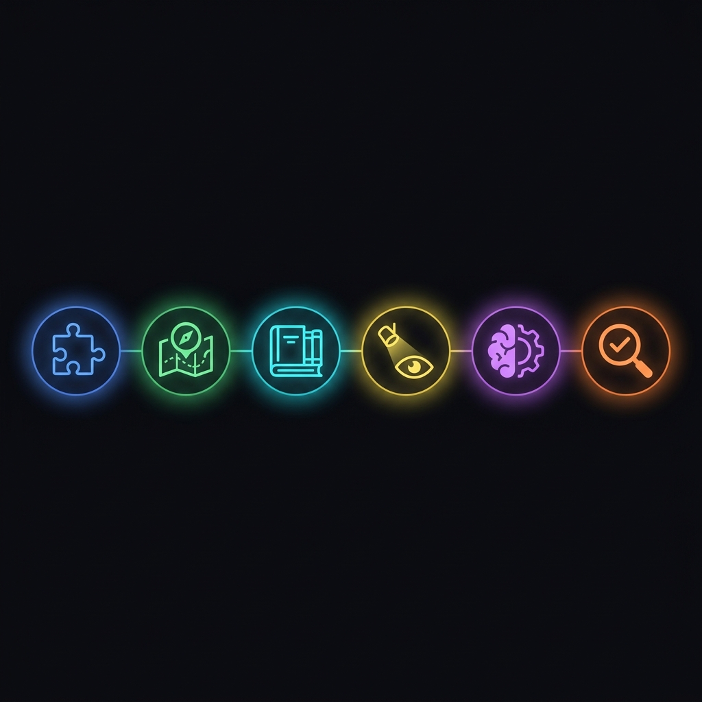

 

| Step | Zara Learned To… | AI Calls It… |
|------|-------------------|--------------|
| 1 | Break images into pieces | **Tokenization** |
| 2 | Map meaning into space | **Embeddings** |
| 3 | Build a searchable library | **Vector Database** |
| 4 | Learn which relationships matter | **Attention** |
| 5 | Create something new | **Transformers** |
| 6 | Check her work | **RAG** |

<!-- 
SLIDE 29 — JOURNEY RECAP
Walk through each row deliberately.
-->

---

<!-- _class: reveal -->

# Now replace "shapes" with…

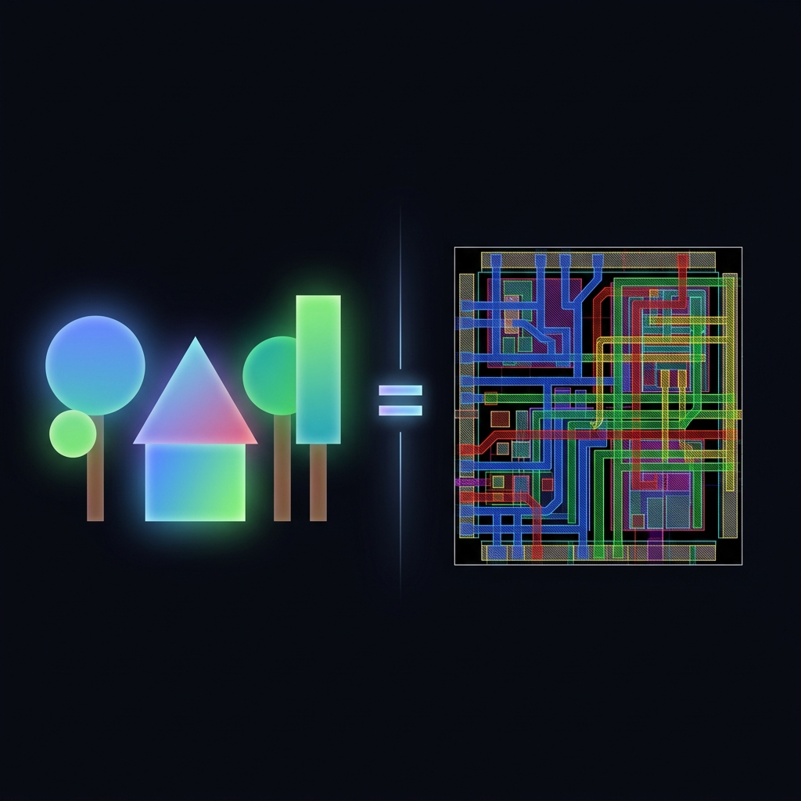

- **Shapes** → Polygons on metal layers
- **Arrangements** → Layout floorplans
- **Library** → Your corporate IP database
- **Parts** → Standard cell primitives

> The math is **identical**.
> The concepts are **identical**.
> The only difference is what the shapes represent.

<!-- 
SLIDE 30 — THE BIG REVEAL
This is the CLIMAX. Slow down.
Let the audience make the connection before you spell it out.
-->

---

# This is already happening.

| Who | What |
|-----|------|
| **Google** | RL + ML for TPU chip floorplanning *(Nature, 2021)* |
| **Cadence** | ML-assisted placement in Virtuoso |
| **Synopsys** | ML constraint extraction in Custom Compiler |
| **ALIGN (DARPA)** | Analog layout from netlists |
| **MAGICAL (UT Austin)** | Automated analog layout generation |

> It's not science fiction. It's happening **right now**,
> in tools some of you are already using.

<!-- 
SLIDE 31 — INDUSTRY PROOF
-->

---

# Your Copilot, Not Your Replacement

Zara learned to see **patterns**.
But she never learned **taste**.

She doesn't know *why* you put those guard rings there.
She doesn't feel the intuition that says
*"that parasitic is going to bite us."*

> AI is the most talented **intern** you've ever had.
> The last 20%? That's **you**. That's the art.
> And that's not going anywhere.

<!-- 
SLIDE 32 — COPILOT MESSAGE
This is where the room exhales.
They've been worrying about job replacement. Address it directly and with conviction.
-->

---

# Three Takeaways

 

**1 AI learns to see shapes the same way it learns to read text**
Break it apart → map meaning → search → attend → generate → verify

 

**2 This is already happening in chip design**
Google, Cadence, Synopsys, ALIGN, MAGICAL — not in 10 years, *now*

 

**3 AI is your copilot, not your replacement**
Patterns are learnable. Taste is not.

<!-- 
SLIDE 33 — THREE TAKEAWAYS
-->

---

<!-- _paginate: false -->
<!-- _class: closing -->

 

# 🛸 Thank You

**Zara went from not knowing what a shape was…
to being able to generate and verify arrangements.**

*That's the GenAI journey, in twenty minutes.*

 

**Michael Kennedy**
*michael.kennedy@analog.com*

 

*Full 6-workshop deep-dive series:*
*github.com/michaelkennedy/genai-self-build*

<!-- 
SLIDE 34 — CLOSING
Hold centre stage. Don't rush off.
Let the applause find you.
-->
