# 🎯 Workshop 1: Text to Numbers (Tokenization)

> **Duration:** 60 minutes (45 min teaching + 15 min Q&A)  
> **Difficulty:** Beginner  
> **Prerequisites:** Basic Python

---

## 🛸 The Alien Analogy

Imagine an alien lands on Earth and needs to learn English. They don't know what "words" are—they just see a stream of symbols. But the alien is clever! They notice:

- `"the"` appears everywhere → assign it one symbol: **θ**
- `"ing"` ends many words → assign it one symbol: **ω**
- `"tion"` is super common → assign it one symbol: **τ**

After studying millions of texts, the alien builds a **codebook** of common patterns. Now they can read English much faster—not letter by letter, but in meaningful chunks!

**This is exactly what tokenization does.** The "alien" is our algorithm, and the "codebook" is our vocabulary.

---

## 📋 Learning Objectives

By the end of this workshop, participants will be able to:

1. ✅ Explain why tokenization is necessary for language models
2. ✅ Implement three tokenization strategies from scratch
3. ✅ Understand the vocabulary-efficiency tradeoff
4. ✅ Compare their tokenizer output to production tokenizers

---

## 📁 Workshop Materials

| File | Description |
|------|-------------|
| [tokenizer.py](tokenizer.py) | Complete tokenizer implementation |
| [test_tokenizer.py](test_tokenizer.py) | Test suite to validate the code |
| [slides/slides.md](slides/slides.md) | Presentation deck (Marp format) |
| [cheatsheet.md](cheatsheet.md) | Quick reference card |
| [qna.md](qna.md) | Common questions and answers |

---

## ⏱️ Session Outline

| Time | Activity | Description |
|------|----------|-------------|
| 0-5 min | **Hook** | "How does ChatGPT read your message?" |
| 5-20 min | **Theory** | Three tokenization strategies explained |
| 20-35 min | **Build** | Implement character & word tokenizers |
| 35-45 min | **Stretch** | BPE tokenizer (optional challenge) |
| 45-60 min | **Q&A** | Questions and wrap-up |

---

## 🧠 Key Concepts

### Why Tokenize?

Neural networks only work with numbers. Tokenization is the bridge:

```mermaid
flowchart LR
    A["📝 'Hello, world!'"] --> B["🔢 Tokenizer"]
    B --> C["[15496, 11, 995]"]
    C --> D["🧠 Neural Network"]
    D --> E["🔤 Decoder"]
    E --> F["💬 Response"]
    
    style B fill:#7b2cbf,stroke:#a855f7
    style D fill:#2563eb,stroke:#3b82f6
```



### Three Strategies

```mermaid
flowchart TD
    subgraph char["Character (~100 tokens)"]
        A1["'cat'"] --> A2["['c','a','t']"]
        A2 --> A3["[0, 1, 2]"]
    end
    subgraph word["Word (~100K tokens)"]
        B1["'the cat'"] --> B2["['the','cat']"]
        B2 --> B3["[5, 42]"]
    end
    subgraph bpe["BPE (~30K tokens) ✨"]
        C1["'unhappy'"] --> C2["['un','happy']"]
        C2 --> C3["[18, 205]"]
    end
```



| Strategy | Vocab Size | Sequence Length | Best For |
|----------|-----------|-----------------|----------|
| **Character** | ~100 | Very Long | Universal coverage |
| **Word** | ~100,000 | Very Short | Simple use cases |
| **BPE** | ~30,000 | Balanced | Production LLMs ✨ |

### The OOV Problem

```mermaid
flowchart LR
    A["'TensorFlow'"] --> B{In vocab?}
    B -->|No| C["❌ UNK"]
    B -->|BPE| D["✅ ['Tensor','Flow']"]
    
    style C fill:#dc2626,stroke:#ef4444
    style D fill:#16a34a,stroke:#22c55e
```



BPE solves unknown words by learning subwords!

---

## 🛠️ Hands-On Build

### What You'll Create

```python
tokenizer = SimpleTokenizer(strategy='word')
tokenizer.train(corpus)

text = "Machine learning is amazing!"
tokens = tokenizer.encode(text)  # [42, 17, 8, 156]
decoded = tokenizer.decode(tokens)  # "machine learning is amazing"
```

### Implementation Walkthrough


**Part 1: Character Tokenizer**
- `_train_char()`: Build character vocabulary
- `_encode_char()`: Text → IDs
- `_decode_char()`: IDs → Text

**Part 2: Word Tokenizer**
- `_tokenize_text()`: Split into words
- `_train_word()`: Build word vocabulary with frequency counting
- `_encode_word()`: Handle unknown words with `<UNK>`
- `_decode_word()`: Join words with spaces

**Part 3: BPE Tokenizer**
- `_get_pair_freqs()`: Count adjacent character pairs
- `_merge_pair()`: Merge most frequent pair
- `_train_bpe()`: Iterative merge algorithm

---

## 🧪 Testing the Implementation

### Run the Demo

```bash
cd workshops/01-tokenization
python tokenizer.py
```

### Run the Test Suite

```bash
cd workshops/01-tokenization

# Run all tests
python test_tokenizer.py

# Run with verbose output
python test_tokenizer.py --verbose
```

### Test Categories

| Category | Tests | What It Validates |
|----------|-------|-------------------|
| Character Tokenizer | 5 | vocab creation, encode/decode, roundtrip |
| Word Tokenizer | 6 | vocab, UNK handling, common words, lowercase |
| BPE Tokenizer | 4 | vocab, merges, encode/decode |
| Edge Cases | 4 | empty strings, special chars, limits |

### Expected Results

```
🎉 ALL TESTS PASSED! (19/19)
```

---

## 🏠 Take-Home Exercises

### Exercise 1: Language Comparison
Tokenize the same sentence in different languages. What do you notice about token counts?

```python
sentences = [
    "Hello, how are you?",      # English
    "Bonjour, comment ça va?",  # French
    "こんにちは、お元気ですか？",  # Japanese
]
```

### Exercise 2: Compare with GPT-4

```python
# pip install tiktoken
import tiktoken
enc = tiktoken.encoding_for_model("gpt-4")

text = "Your test sentence here"
gpt4_tokens = enc.encode(text)
your_tokens = your_tokenizer.encode(text)

print(f"GPT-4: {len(gpt4_tokens)} tokens")
print(f"Yours: {len(your_tokens)} tokens")
```

### Exercise 3: Full BPE
If you didn't complete BPE in the workshop, implement the full algorithm including encoding and decoding.

---

## 🔗 Resources

- [OpenAI Tokenizer Playground](https://platform.openai.com/tokenizer)
- [Hugging Face Tokenizers Library](https://huggingface.co/docs/tokenizers)
- [BPE Paper](https://arxiv.org/abs/1508.07909)
- [tiktoken Source Code](https://github.com/openai/tiktoken)

---

## ➡️ Next Workshop

**Workshop 2: Meaning in Math (Embeddings)**

We'll turn token IDs into meaningful vectors and build Word2Vec from scratch!

```python
king - man + woman ≈ queen  # Vector arithmetic magic!
```

---

*Workshop 1 of 6 | GenAI Self-Build Series*
