# 📋 Tokenization Cheat Sheet

> **Quick reference for Workshop 1: Text to Numbers**

---

## 🎯 What is Tokenization?

**Tokenization** = Converting text into numbers that neural networks can process

```mermaid
flowchart LR
    A["📝 Hello world"] --> B["🔢 Tokenize"]
    B --> C["[15496, 995]"]
    C --> D["🧠 Neural Network"]
    D --> E["[1324, 567]"]
    E --> F["🔤 Decode"]
    F --> G["💬 Response"]
```



---

## 📊 Three Tokenization Strategies

```mermaid
flowchart TD
    subgraph Character["📝 Character"]
        A1["'Hello'"] --> A2["'H','e','l','l','o'"]
        A2 --> A3["[0,1,2,2,3]"]
    end
    
    subgraph Word["📖 Word"]
        B1["'Hello world'"] --> B2["'hello','world'"]
        B2 --> B3["[0,1]"]
    end
    
    subgraph BPE["✨ BPE"]
        C1["'lower'"] --> C2["'low','er'"]
        C2 --> C3["[42,17]"]
    end
```



| Strategy | Vocab Size | Sequence Length | OOV Handling | Used By |
|----------|-----------|-----------------|--------------|---------|
| **Character** | ~100 | Very Long | Perfect | Early RNNs |
| **Word** | ~100,000 | Very Short | Poor | Word2Vec |
| **BPE** | ~30,000 | Balanced | Good | GPT, BERT, Claude |
### 🎭 Analogies to Remember

| Strategy | Analogy |
|----------|---------|
| **Character** | 📞 Spelling every word letter-by-letter on the phone |
| **Word** | 📖 A dictionary where each word has its own page number |
| **BPE** | 📦 Shipping boxes — group items that often ship together |
---

## 💻 Quick Code Reference

### Character Tokenizer
```python
# Training
unique_chars = sorted(set(''.join(corpus)))
vocab = {char: idx for idx, char in enumerate(unique_chars)}

# Encoding
encoded = [vocab[char] for char in text]

# Decoding
decoded = ''.join(inverse_vocab[tok] for tok in tokens)
```

### Word Tokenizer
```python
import re
from collections import Counter

# Tokenize text
words = re.findall(r'\b\w+\b', text.lower())

# Build vocabulary
word_counts = Counter(words)
most_common = word_counts.most_common(vocab_size - 2)
vocab = {'<UNK>': 0, '<PAD>': 1}
for idx, (word, _) in enumerate(most_common, start=2):
    vocab[word] = idx

# Encoding (handle unknown words)
encoded = [vocab.get(word, 0) for word in words]  # 0 = <UNK>
```

### BPE Tokenizer
```python
# Core algorithm
while len(vocab) < vocab_size:
    pair_freqs = count_adjacent_pairs(word_freqs)
    best_pair = max(pair_freqs, key=pair_freqs.get)
    word_freqs = merge_pair(word_freqs, best_pair)
    vocab[best_pair[0] + best_pair[1]] = len(vocab)
    merges.append(best_pair)
```

---

## 📖 Key Terms

| Term | Definition |
|------|------------|
| **Token** | A unit of text (character, word, or subword) |
| **Vocabulary** | The set of all known tokens |
| **Token ID** | The integer assigned to a token |
| **OOV** | Out-of-vocabulary (unknown word) |
| **BPE** | Byte Pair Encoding (subword algorithm) |
| **Merge** | Combining two tokens into one (in BPE) |
| **`<UNK>`** | Special token for unknown words |
| **`<PAD>`** | Special token for padding sequences |
| **Encode** | Text → Token IDs |
| **Decode** | Token IDs → Text |

---

## 🔢 BPE Merge Algorithm

```mermaid
flowchart TD
    A["Start: characters + end marker<br/>'low' → ('l','o','w','&lt;/w&gt;')"] --> B["Count adjacent pairs"]
    B --> C["('l','o') appears 5×"]
    C --> D["Merge most frequent"]
    D --> E["('lo','w','&lt;/w&gt;')"]
    E --> F{Vocab size<br/>reached?}
    F -->|No| B
    F -->|Yes| G["Done! Apply merges in order"]
```



### Step by Step:
1. **Start**: Split all words into characters + `</w>` marker
2. **Count**: Find most frequent adjacent pair
3. **Merge**: Combine that pair everywhere  
4. **Repeat**: Until vocabulary reaches target size
5. **Result**: Common sequences become single tokens

---

## ⚠️ Common Pitfalls

| Problem | Solution |
|---------|----------|
| Case sensitivity | Lowercase during tokenization |
| Punctuation attached to words | Use regex: `r'\b\w+\b'` |
| Unknown words crash | Always use `.get(word, 0)` |
| Empty vocabulary | Check corpus isn't empty |
| Wrong decode order | Use `inverse_vocab` dictionary |
| BPE merges not applied in order | Store and apply merges sequentially |

---

## 🧮 Useful Formulas

### Cosine Similarity (for later workshops)
```python
similarity = np.dot(a, b) / (np.linalg.norm(a) * np.linalg.norm(b))
```

### Vocabulary Coverage
```python
coverage = known_tokens / total_tokens
# Aim for > 95% coverage
```

### Compression Ratio
```python
ratio = len(text) / len(tokens)
# Higher = more efficient tokenization
```

---

## 🔗 Real-World Tokenizers

| Model | Tokenizer | Vocab Size |
|-------|-----------|------------|
| GPT-4 | `tiktoken` (BPE) | ~100,000 |
| GPT-3 | `tiktoken` (BPE) | ~50,000 |
| BERT | WordPiece | ~30,000 |
| LLaMA | SentencePiece | ~32,000 |
| Claude | BPE variant | ~100,000 |

### Try it yourself:
```python
# Install: pip install tiktoken
import tiktoken
enc = tiktoken.encoding_for_model("gpt-4")
tokens = enc.encode("Hello, world!")
print(tokens)  # [9906, 11, 1917, 0]
```

---

## 🎯 Key Takeaways

**🛸 Remember the Alien!**
> Tokenization is how an alien (the algorithm) learns to read English by spotting common patterns and building a codebook.

1. **Tokenization is step 1** - Every LLM needs it
2. **BPE is the standard** - Balances vocab size and sequence length  
3. **Vocabulary matters** - Too small = OOV, too large = inefficient
4. **Special tokens are important** - `<UNK>`, `<PAD>`, `<EOS>`
5. **Order matters in BPE** - Apply merges in training order

---

## 📚 Quick Reference: Python Imports

```python
from collections import Counter  # Count word frequencies
import re                        # Regex for tokenization
from typing import Dict, List    # Type hints
import numpy as np              # For later workshops
```

---

## 🏃 Quick Test

```python
# Test your tokenizer works
tokenizer = SimpleTokenizer(strategy='word')
tokenizer.train(["Hello world", "Hello there"])

assert tokenizer.encode("Hello world") == [2, 3]  # After special tokens
assert tokenizer.decode([2, 3]) == "hello world"
print("✅ All tests passed!")
```

---

*Workshop 1 of 6 | GenAI Self-Build Series*
