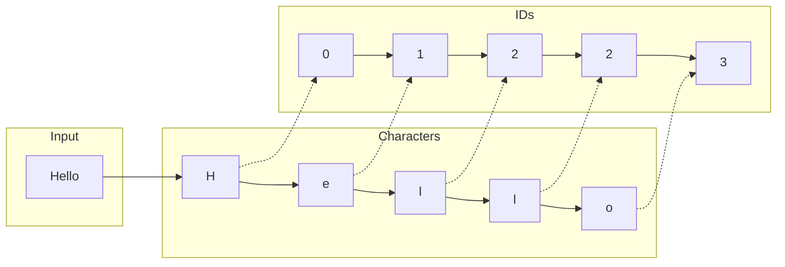
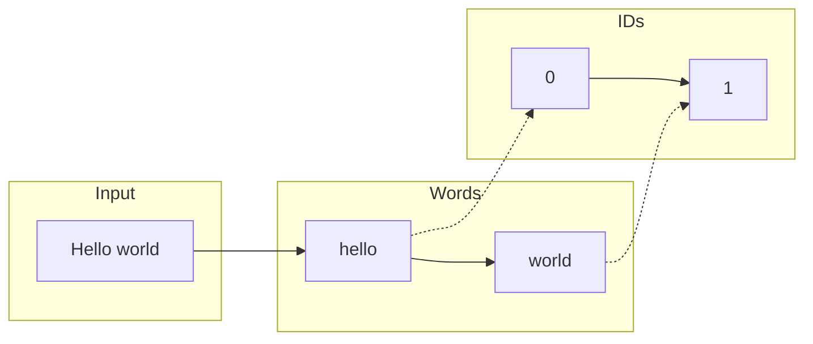
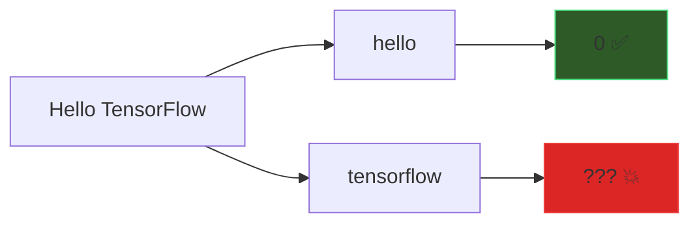
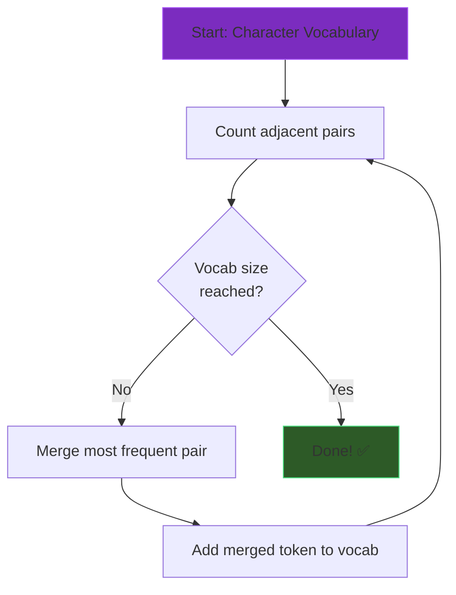
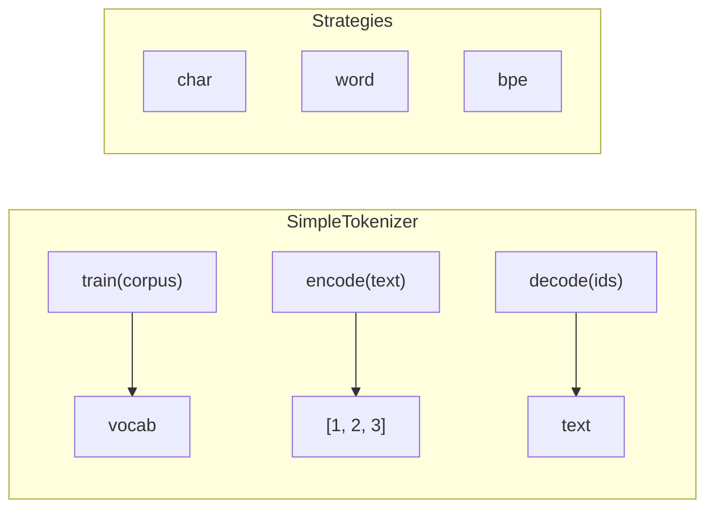
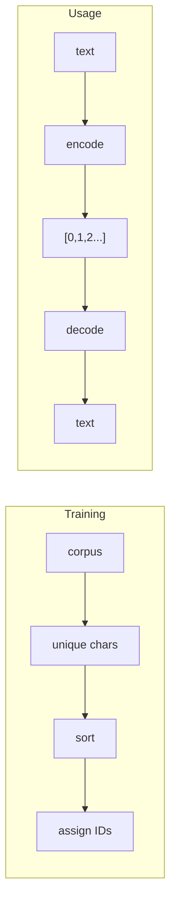
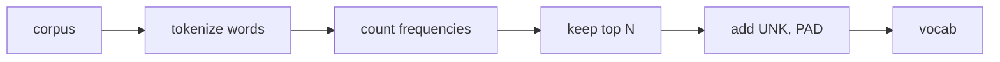
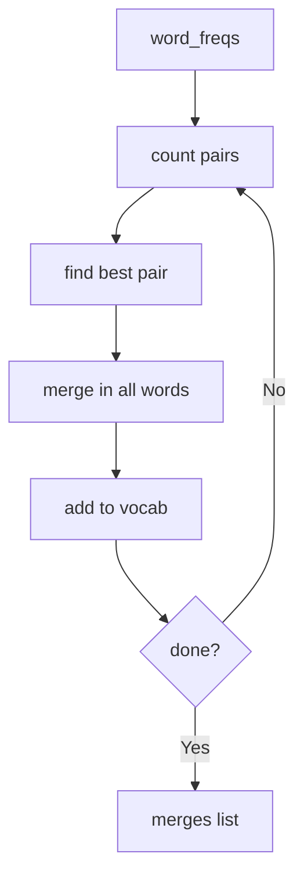

# 🎯 Workshop 1: Text to Numbers

## **Tokenization: The First Step in GenAI**

GenAI Self-Build Series | Session 1 of 6

---

# 📋 Today's Agenda

1. **Why tokenization matters** (5 min)
2. **Three tokenization strategies** (10 min)
3. **Hands-on: Build your own tokenizer** (25 min)
4. **Compare with production tokenizers** (5 min)
5. **Q&A** (15 min)

### By the end, you'll have built what powers ChatGPT!

---

# 🤔 The Problem

## Computers don't understand text


Neural networks only work with **numbers**!

We need a way to convert text → numbers → text. This is called **tokenization** 🎯

---

# 🛸 The Alien Analogy

## Imagine you're an alien trying to read English...

You don't know what "words" are. You just see symbols:

```
Thequickbrownfoxjumpsoverthelazydog
```

But you notice **patterns**:
- `"the"` appears constantly → give it one symbol: **θ**
- `"ing"` ends many words → give it one symbol: **ω**  
- `"tion"` is common → give it one symbol: **τ**

After studying millions of texts, you build a **codebook** of patterns.

### 🎯 This is exactly what BPE does! The algorithm is the "alien."

---

# ❌ Why Not Just Use ASCII?

ASCII maps characters to numbers... so we're done, right?

```python
"Hello" → [72, 101, 108, 108, 111]  # ASCII codes
```

### Problems:

| Issue | Why It Matters |
|-------|----------------|
| No meaning | `72` doesn't mean "start of greeting" |
| Fixed mapping | Can't learn better representations |
| No vocabulary control | Every unicode char = separate ID |
| Inefficient | `"the"` = 3 tokens, even though it's very common |

**We need smarter tokenization!**

---

# 📝 Strategy 1: Character Tokenization

## The simplest approach: one character = one token

**📚 Analogy**: Like spelling out every word letter-by-letter on the phone:
> "H-E-L-L-O W-O-R-L-D" — accurate but tedious!



| ✅ Pros | ❌ Cons |
|---------|--------|
| Tiny vocabulary (~100 chars) | Very long sequences |
| Handles ANY text | Loses word-level meaning |

---

# 📝 Strategy 2: Word Tokenization

## One word = one token

**📖 Analogy**: Like a dictionary where every word has a page number:
> "Hello" = page 4,821 | "World" = page 52,344



| ✅ Pros | ❌ Cons |
|---------|--------|
| Short sequences | Huge dictionary (100K+ pages) |
| Preserves word meaning | **OOV Problem**: New words aren't in the book! |

---

# 🚨 The OOV Problem

## What happens with unknown words?



### Solutions:
| Approach | Drawback |
|----------|----------|
| `<UNK>` token | Loses information |
| Larger vocab | More memory needed |
| **Subword (BPE)** | ✅ Best of both worlds! |

---

# 📝 Strategy 3: Subword / BPE

## **Byte Pair Encoding**: Learn common character sequences

**📦 Analogy**: Like shipping boxes — group items that often ship together!
> "un" + "believe" + "able" is more efficient than 11 single letters

```mermaid
flowchart TD
    A["'l' 'o' 'w' 'e' 'r'"] -->|"merge (l,o)"| B["'lo' 'w' 'e' 'r'"]
    B -->|"merge (lo,w)"| C["'low' 'e' 'r'"]
    C -->|"merge (e,r)"| D["'low' 'er'"]
    
    style A fill:#2d2d44,stroke:#7b2cbf
    style D fill:#2d5a27,stroke:#4ade80
```



**Result**: `"lower"` → `['low', 'er']` — Just 2 tokens!

### 🎯 This is what GPT, BERT, Claude all use!

---

# 🔄 BPE Algorithm



### Example on `"low lower lowest"`:
| Iteration | Most Frequent | Action |
|-----------|---------------|--------|
| 1 | `('l', 'o')` = 3× | → `'lo'` |
| 2 | `('lo', 'w')` = 3× | → `'low'` |
| 3 | `('e', 'r')` = 1× | → `'er'` |

---

# 📊 Strategy Comparison

| Strategy | Vocab Size | Sequence Length | OOV Handling |
|----------|-----------|-----------------|--------------|
| Character | ~100 | Very Long 📛 | Perfect ✅ |
| Word | ~100,000 | Very Short ✅ | Poor 📛 |
| BPE | ~30,000 | Balanced ✅ | Good ✅ |

### Real-world examples:
- **GPT-4**: ~100,000 BPE tokens
- **BERT**: ~30,000 WordPiece tokens
- **LLaMA**: ~32,000 SentencePiece tokens

---

# 🖥️ Live Demo Preview

```python
tokenizer = SimpleTokenizer(strategy='word')
tokenizer.train(corpus)

text = "Machine learning is amazing!"
tokens = tokenizer.encode(text)  # [42, 17, 8, 156]
decoded = tokenizer.decode(tokens)  # "machine learning is amazing"
```

Let's see it in action! 🚀

---

# 🛠️ Code Walkthrough

## Let's explore the multi-strategy tokenizer



### File: `tokenizer.py`

Three strategies to explore:
1. **Character tokenizer** — Simple but verbose
2. **Word tokenizer** — Compact but limited
3. **BPE tokenizer** — Best of both worlds!

---

# 🎯 Part 1: Character Tokenizer



```python
def _train_char(self, corpus):
    all_text = ''.join(corpus)
    unique_chars = sorted(set(all_text))
    self.vocab = {char: idx for idx, char in enumerate(unique_chars)}
```

---

# 🎯 Part 2: Word Tokenizer



```python
def _train_word(self, corpus, vocab_size):
    # Count frequencies
    word_counts = Counter(all_words)
    most_common = word_counts.most_common(vocab_size - 2)
    
    # Special tokens first
    self.vocab = {'<UNK>': 0, '<PAD>': 1}
    for idx, (word, _) in enumerate(most_common, start=2):
        self.vocab[word] = idx
```

---

# 🎯 Part 3: BPE Tokenizer



```python
def _train_bpe(self, corpus, vocab_size):
    while len(self.vocab) < vocab_size:
        pair_freqs = self._get_pair_freqs(word_freqs)
        best_pair = max(pair_freqs, key=pair_freqs.get)
        word_freqs = self._merge_pair(word_freqs, best_pair)
        self.merges.append(best_pair)
```

**This is how GPT tokenizers work!**

---

# 🏆 Key Takeaways

### 🛸 Remember the alien!
Tokenization is how an alien (the algorithm) learns to read by finding patterns

### 1. **Tokenization is fundamental**
Every LLM starts by converting text to numbers

### 2. **Strategy matters**
| Strategy | Analogy |
|----------|--------|
| Character | Spelling out every letter on the phone |
| Word | Dictionary with a page for each word |
| BPE | Shipping boxes — group common items |

### 3. **You built what powers ChatGPT!**
Same core concepts as billion-dollar models

---

# 📅 Coming Up Next

## Workshop 2: Meaning in Math (Embeddings)

- Turn token IDs into meaningful vectors
- Build Word2Vec from scratch
- `king - man + woman = queen` 👑

### Take-home challenge:
Extend your BPE tokenizer to handle the full merge algorithm!

---

# ❓ Q&A Time

### Common questions we'll cover:
- How does GPT-4's tokenizer compare?
- Why do LLMs struggle with math?
- What's the ideal vocabulary size?
- How do multilingual models tokenize?

**15 minutes - Ask anything!**

---

# 📚 Resources

### Workshop Files
```
workshops/01-tokenization/
├── tokenizer.py      # Complete implementation
├── test_tokenizer.py # Test suite
├── cheatsheet.md     # Quick reference
└── slides/           # This presentation
```

### Further Reading
- [OpenAI Tokenizer](https://platform.openai.com/tokenizer)
- [Hugging Face Tokenizers](https://huggingface.co/docs/tokenizers)
- [BPE Paper](https://arxiv.org/abs/1508.07909)

---

# 🙏 Thank You!

## See you at Workshop 2: Embeddings!

Questions? Reach out anytime.

**Next session**: Turning tokens into meaning with vector representations

