# 🗺️ Workshop 2: Words to Meaning (Embeddings)

> **Duration:** 60 minutes (45 min teaching + 15 min Q&A)  
> **Difficulty:** Beginner  
> **Prerequisites:** Workshop 1 (Tokenization), Basic Python

---

## 🛸 The Map Analogy

After learning to read symbols (tokenization), our alien friend faces a new challenge: **understanding what words MEAN**.

The alien decides to create a **map of Earth languages**. On this map:

- Words that mean similar things are placed **CLOSE** together
- `"king"` lives near `"queen"`, `"prince"`, `"royalty"`
- `"cat"` lives near `"dog"`, `"pet"`, `"animal"`
- `"happy"` lives **far from** `"sad"`

But here's the magical part—the alien discovers that **meaning follows directions!**

```
king - man + woman = queen  ← Vector arithmetic with words!
```

The direction from "king" to "queen" is the same as "man" to "woman". It's like GPS for language!

**This is exactly what embeddings do.** Each word becomes a point in space (a vector of numbers), where the POSITION captures meaning relative to all other words.

---

## 📋 Learning Objectives

By the end of this workshop, participants will be able to:

1. ✅ Explain how words become vectors with meaning
2. ✅ Implement three embedding strategies from scratch
3. ✅ Find similar words using cosine similarity
4. ✅ Solve word analogies with vector arithmetic

---

## 📁 Workshop Materials

| File | Description |
|------|-------------|
| [embeddings.py](embeddings.py) | Complete embedding implementation |
| [test_embeddings.py](test_embeddings.py) | Test suite to validate the code |
| [app.py](app.py) | Interactive Streamlit demo |
| [slides/slides.md](slides/slides.md) | Presentation deck (Marp format) |
| [cheatsheet.md](cheatsheet.md) | Quick reference card |
| [qna.md](qna.md) | Common questions and answers |

---

## ⏱️ Session Outline

| Time | Activity | Description |
|------|----------|-------------|
| 0-5 min | **Hook** | "King - Man + Woman = Queen" demo |
| 5-15 min | **Theory** | From tokens to meaning (3 strategies) |
| 15-35 min | **Build** | Implement embedding strategies |
| 35-45 min | **Explore** | Similarity search and analogies |
| 45-60 min | **Q&A** | Questions and wrap-up |

---

## 🧠 Key Concepts

### From Tokens to Meaning

Workshop 1 turned text into numbers. But those numbers have **no meaning**:

```mermaid
flowchart LR
    A["Token ID: 42"] --> B{What does it mean?}
    B --> C["❓ No idea!"]
    
    style C fill:#dc2626,stroke:#ef4444
```



Embeddings add meaning by placing each token in a **semantic space**:


### The Distributional Hypothesis

> "You shall know a word by the company it keeps" — J.R. Firth (1957)

Words that appear in similar **contexts** have similar **meanings**:

```
"The ___ sat on the throne." → king, queen, prince
"The ___ chased the mouse." → cat, kitten, pet
```

### Three Strategies

```mermaid
flowchart TD
    subgraph random["🎲 Random (Baseline)"]
        A1["No learning"]
        A2["Random positions"]
        A3["❌ No meaning"]
    end
    subgraph cooccur["🔗 Co-occurrence"]
        B1["Count neighbors"]
        B2["SVD reduction"]
        B3["✅ Context = meaning"]
    end
    subgraph predict["🎯 Prediction"]
        C1["Learn to predict"]
        C2["Neural training"]
        C3["✅ Fine-grained meaning"]
    end
```



| Strategy | How It Works | Pros | Cons |
|----------|--------------|------|------|
| **Random** | Random vectors | Fast, simple | No semantic meaning |
| **Co-occurrence** | Count nearby words, use SVD | Interpretable, fast | Needs lots of data |
| **Prediction** | Learn to predict context | Captures nuance | Slower training |

### Vector Arithmetic Magic

```mermaid
flowchart LR
    A["👑 king"] --> B["-"]
    C["👨 man"] --> B
    B --> D["+"]
    E["👩 woman"] --> D
    D --> F["👸 ≈ queen"]
    
    style F fill:#16a34a,stroke:#22c55e
```



Embeddings encode **relationships as directions**:
- `king - man = "royalty"` direction
- `"royalty" + woman = queen`

---

## 🛠️ Hands-On Build

### What You'll Create

```python
embedder = SimpleEmbedding(strategy='cooccurrence', dimensions=50)
embedder.train(corpus)

# Find similar words
embedder.most_similar("king")  
# [("queen", 0.89), ("prince", 0.82), ...]

# Solve analogies
embedder.analogy("king", "queen", "man")  
# [("woman", 0.78)]

# Check similarity
embedder.similarity("cat", "dog")  # 0.85
embedder.similarity("cat", "computer")  # 0.12
```

### Implementation Walkthrough


**Part 1: Random Embeddings**
- `_train_random()`: Assign random vectors (baseline)
- Useful for comparison—shows random ≠ meaning

**Part 2: Co-occurrence Embeddings**
- `_train_cooccurrence()`: Build word-word matrix
- `_apply_ppmi()`: Transform counts to associations
- `_svd_reduce()`: Compress to fixed dimensions

**Part 3: Prediction Embeddings**
- `_train_prediction()`: Skip-gram style learning
- `_skip_gram_step()`: Gradient updates
- Learn by predicting neighboring words

### Core Methods

| Method | Input | Output | Description |
|--------|-------|--------|-------------|
| `train(corpus)` | List of texts | None | Learn embeddings from text |
| `get_vector(word)` | "king" | [0.2, -0.5, ...] | Get word's vector |
| `similarity(w1, w2)` | "king", "queen" | 0.89 | Cosine similarity |
| `most_similar(word)` | "king" | [("queen", 0.89), ...] | Find nearest neighbors |
| `analogy(a, b, c)` | "king", "queen", "man" | [("woman", 0.78)] | Solve a:b::c:? |

---

## 🧪 Testing the Implementation

### Run the Demo

```bash
cd workshops/02-embeddings
python embeddings.py
```

### Run the Test Suite

```bash
cd workshops/02-embeddings
python test_embeddings.py
```

### Launch the Interactive App

```bash
cd workshops/02-embeddings
streamlit run app.py
```

### Expected Demo Output

```
📊 TEST 1: Word Similarity
Word Pair            Random       Co-occur     Predict
--------------------------------------------------------
king / queen         -0.034       0.630        0.641
cat / dog            0.354        0.080        0.549

✨ TEST 3: Word Analogies
❓ king : queen :: man : ?
   Cooccurrence   : she (0.77), is (0.70), woman (0.61)
```

---

## 🏠 Take-Home Exercises

### Exercise 1: Explore Your Vocabulary

Train embeddings on custom text (a book, Wikipedia, your emails) and explore:
- What words cluster together?
- Do the analogies make sense?

### Exercise 2: Visualize with t-SNE

```python
from sklearn.manifold import TSNE
import matplotlib.pyplot as plt

# Reduce to 2D for visualization
tsne = TSNE(n_components=2, random_state=42)
coords = tsne.fit_transform(embedder.embeddings)

# Plot words
for i, word in enumerate(embedder.get_all_words()[:50]):
    plt.scatter(coords[i, 0], coords[i, 1])
    plt.annotate(word, (coords[i, 0], coords[i, 1]))
plt.show()
```

### Exercise 3: Compare with Word2Vec

```python
import gensim.downloader as api

# Load pre-trained Word2Vec (trained on Google News)
word2vec = api.load("word2vec-google-news-300")

# Compare
print(word2vec.most_similar("king", topn=5))
print(word2vec.similarity("cat", "dog"))
```

---

## 📊 Key Formulas

### Cosine Similarity

$$\text{similarity}(a, b) = \frac{a \cdot b}{||a|| \times ||b||} = \cos(\theta)$$

Range: -1 (opposite) to 1 (identical)

### PMI (Pointwise Mutual Information)

$$\text{PMI}(x, y) = \log_2 \frac{P(x, y)}{P(x) \times P(y)}$$

Measures if words co-occur more than chance.

### Skip-gram Objective

$$\max \sum_{t=1}^{T} \sum_{-c \leq j \leq c, j \neq 0} \log P(w_{t+j} | w_t)$$

Learn word vectors that predict context words.

---

## 🔗 Connection to LLMs

### How ChatGPT Uses Embeddings


Every LLM has an **embedding matrix**:
- GPT-4: ~100K tokens × ~12,288 dimensions
- That's 1.2 BILLION parameters just for embeddings!

### Pre-trained Embeddings

Modern LLMs don't train embeddings from scratch—they:
1. Learn embeddings during pre-training on trillions of tokens
2. Fine-tune on specific tasks
3. Use contextual embeddings (the SAME word can have DIFFERENT vectors based on context!)

---

## 🔗 Resources

- [Word2Vec Paper](https://arxiv.org/abs/1301.3781) - Original Skip-gram/CBOW
- [GloVe Paper](https://nlp.stanford.edu/pubs/glove.pdf) - Co-occurrence approach
- [Embedding Projector](https://projector.tensorflow.org/) - Visualize embeddings
- [Gensim Word2Vec Tutorial](https://radimrehurek.com/gensim/models/word2vec.html)

---

## ➡️ Next Workshop

**Workshop 3: Vector Databases**

Now that words are vectors, how do we search millions of them **fast**?

```mermaid
flowchart LR
    A["Query: 'king'"] --> B["🗄️ Vector DB"]
    B --> C["Top 5 most similar"]
    C --> D["queen, prince, royal..."]
    
    style B fill:#f59e0b,stroke:#fbbf24
```



We'll build a similarity search engine using HNSW and approximate nearest neighbors!

---

*Workshop 2 of 6 | GenAI Self-Build Series*
