# 📋 Embeddings Cheat Sheet

> **Quick reference for Workshop 2: Words to Meaning**

---

## 🎯 What are Embeddings?

**Embeddings** = Converting token IDs into meaningful vectors where similar words are nearby

```mermaid
flowchart LR
    A["Token ID: 42<br/>'king'"] --> B["🗺️ Embedding Layer"]
    B --> C["[0.8, -0.2, 0.5, ...]"]
    C --> D["📍 Point in<br/>meaning space"]
    
    style B fill:#8b5cf6,stroke:#a855f7
```



---

## 📊 Three Embedding Strategies

```mermaid
flowchart TD
    subgraph Random["🎲 Random"]
        A1["Random vectors"]
        A2["No meaning"]
        A3["Baseline only"]
    end
    
    subgraph Cooccur["🔗 Co-occurrence"]
        B1["Count neighbors"]
        B2["PPMI transform"]
        B3["SVD reduce"]
    end
    
    subgraph Predict["🎯 Prediction"]
        C1["Skip-gram pairs"]
        C2["Negative sampling"]
        C3["SGD training"]
    end
```



| Strategy | How It Works | Pros | Cons |
|----------|--------------|------|------|
| **Random** | Random vectors | Fast, baseline | No meaning |
| **Co-occurrence** | Count + SVD | Fast, interpretable | Needs lots of data |
| **Prediction** | Learn to predict | Captures nuance | Slower training |

### 🎭 Analogies to Remember

| Strategy | Analogy |
|----------|---------|
| **Random** | 🎯 Throwing darts blindfolded at a map |
| **Co-occurrence** | 📚 Library books shelved by what's borrowed together |
| **Prediction** | 🎮 Word guessing game — predict the neighbors! |

---

## 💻 Quick Code Reference

### Creating and Training Embeddings
```python
from embeddings import SimpleEmbedding

# Create embedder (choose strategy)
embedder = SimpleEmbedding(strategy='cooccurrence', dimensions=50)

# Train on corpus
corpus = ["The king ruled the kingdom.", "The queen was wise."]
embedder.train(corpus)
```

### Getting Word Vectors
```python
# Get a single word's vector
vec = embedder.get_vector("king")  # shape: (50,)

# Get all words in vocabulary
words = embedder.get_all_words()  # ["the", "king", "queen", ...]
```

### Finding Similar Words
```python
# Most similar to a word
similar = embedder.most_similar("king", top_n=5)
# [("queen", 0.89), ("prince", 0.82), ("royal", 0.78), ...]

# Similarity between two words
sim = embedder.similarity("king", "queen")  # 0.89
```

### Solving Analogies
```python
# king : queen :: man : ?
result = embedder.analogy("king", "queen", "man", top_n=1)
# [("woman", 0.78)]

# The math: queen - king + man ≈ woman
```

---

## 📖 Key Terms

| Term | Definition |
|------|------------|
| **Embedding** | Dense vector representation of a word |
| **Dimensions** | Size of embedding vector (50-300 typical) |
| **Cosine Similarity** | Measure of angle between vectors (-1 to 1) |
| **Co-occurrence** | How often words appear near each other |
| **PPMI** | Positive Pointwise Mutual Information |
| **SVD** | Singular Value Decomposition (matrix factorization) |
| **Skip-gram** | Predict context words from center word |
| **Negative Sampling** | Train on fake pairs to prevent collapse |
| **Window Size** | How many words left/right to consider |

---

## 🧮 Key Formulas

### Cosine Similarity
$$\text{similarity}(a, b) = \frac{a \cdot b}{||a|| \times ||b||} = \cos(\theta)$$

```python
import numpy as np

def cosine_similarity(a, b):
    return np.dot(a, b) / (np.linalg.norm(a) * np.linalg.norm(b))
```

### PMI (Pointwise Mutual Information)
$$\text{PMI}(x, y) = \log_2 \frac{P(x, y)}{P(x) \times P(y)}$$

- **Positive PMI** → Words appear together more than chance
- **PPMI** = max(0, PMI) — only keep positive associations

### Analogy Formula
```python
# a : b :: c : ?
target = vec_b - vec_a + vec_c
answer = find_closest_word(target)
```

---

## 🔢 Co-occurrence Pipeline


### Step by Step:
1. **Count**: For each word, count neighbors within window
2. **Weight**: Closer words get higher weight (1/distance)
3. **PPMI**: Transform raw counts to meaningful associations
4. **SVD**: Reduce V×V matrix to V×D (D = dimensions)
5. **Normalize**: Make all vectors unit length

---

## 🎯 Prediction Pipeline


### Key Concepts:
- **Positive pairs**: Real neighboring words (label=1)
- **Negative pairs**: Random non-neighbors (label=0)
- **Objective**: Make positive pairs similar, negative pairs different

---

## ⚠️ Common Pitfalls

| Problem | Solution |
|---------|----------|
| Word not in vocab | Check with `word in embedder.vocab` first |
| All similarities ~0 | Train on more data or check normalization |
| Analogies fail | Need more training data + balanced corpus |
| SVD fails | Handle with try/except, fallback to random |
| Slow training | Reduce vocab size or dimensions |
| Memory issues | Use sparse matrices for co-occurrence |

---

## 📏 Choosing Dimensions

| Dimensions | Use Case | Trade-off |
|------------|----------|-----------|
| 50 | Quick experiments | Less expressive |
| 100-300 | Standard NLP tasks | Good balance |
| 768+ | BERT-style models | Very expressive, slow |

**Rule of thumb**: Start with 50-100, increase if needed.

---

## 🔗 Real-World Embeddings

| Model | Type | Dimensions | Contextual? |
|-------|------|------------|-------------|
| Word2Vec | Skip-gram | 300 | No |
| GloVe | Co-occurrence | 50-300 | No |
| FastText | Subword | 300 | No |
| BERT | Transformer | 768 | ✅ Yes |
| GPT-4 | Transformer | ~12,288 | ✅ Yes |

### Try pretrained Word2Vec:
```python
import gensim.downloader as api
word2vec = api.load("word2vec-google-news-300")
word2vec.most_similar("king", topn=5)
word2vec.similarity("cat", "dog")
```

---

## 🎯 Key Takeaways

> **🗺️ Remember the Map!**
> Embeddings create a semantic space where similar words are neighbors and directions encode relationships.

1. **Token IDs are meaningless** — Embeddings add semantic structure
2. **"You know a word by its neighbors"** — Co-occurrence = meaning
3. **Distance = Meaning difference** — Use cosine similarity
4. **Directions encode relationships** — `king - man + woman = queen`
5. **More data = Better embeddings** — Quality scales with corpus size

---

## 🧪 Quick Test

```python
# Test your embeddings work
embedder = SimpleEmbedding(strategy='cooccurrence', dimensions=30)
embedder.train(["The king and queen ruled.", "The cat and dog played."])

# Should find related words
similar = embedder.most_similar("king")
assert any(w == "queen" for w, _ in similar[:3])

# Similarity should be valid range
sim = embedder.similarity("king", "queen")
assert -1 <= sim <= 1

print("✅ All tests passed!")
```

---

## 📚 Quick Reference: Python Imports

```python
import numpy as np                    # Vector operations
from collections import Counter       # Count word frequencies
from collections import defaultdict   # Co-occurrence matrix
import re                             # Tokenization
from typing import Dict, List, Tuple  # Type hints
```

---

*Workshop 2 of 6 | GenAI Self-Build Series*
