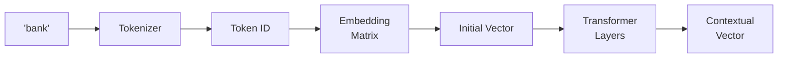

# ❓ Workshop 2: Q&A Reference

> **Common questions and answers about word embeddings**

---

## 🗺️ The Big Picture: The Map Analogy

Our alien friend from Workshop 1 has mastered reading symbols (tokenization). But token IDs like 42, 87, 156 are just arbitrary numbers—they don't capture that "king" and "queen" are related!

The alien decides to create a **map of meaning**:
- Words with similar meanings are placed **close together**
- "King" lives near "queen", "prince", "royalty"
- "Cat" lives near "dog", "pet", "animal"
- Directions on the map encode relationships!

The alien discovers something magical: **meaning follows directions!**
- The path from "king" to "queen" = the path from "man" to "woman"
- So: `king - man + woman ≈ queen`

**This is exactly what embeddings do.** Each word becomes a point in space where position = meaning.

---

## Conceptual Questions

### Q1: Why not just use token IDs?

**🗺️ Analogy Answer:**
Imagine if the alien just numbered words alphabetically:
- "king" = 42
- "queen" = 87
- "pizza" = 73

To a neural network, 42 and 87 look just as different as 42 and 73! But semantically, "king" and "queen" are **much** more related than "king" and "pizza."

**Technical Answer:**
Token IDs are arbitrary integers with no semantic structure:
- No notion of similarity (|42-87| vs |42-73| is meaningless)
- No compositionality (can't do math with meanings)
- No generalization (new words can't leverage learned patterns)

Embeddings solve this by placing words in a continuous vector space where:
- Similar words → similar vectors
- Relationships → directions
- New words can interpolate from known words

```python
# Token IDs: meaningless distance
dist(king=42, queen=87) = 45
dist(king=42, pizza=73) = 31  # Pizza is "closer"? Wrong!

# Embeddings: meaningful distance
cosine(king_vec, queen_vec) = 0.89  # Very similar! ✅
cosine(king_vec, pizza_vec) = 0.12  # Very different! ✅
```

---

### Q2: How do embeddings capture meaning?

**🗺️ Analogy Answer:**
The alien learns that words appearing in similar **neighborhoods** probably mean similar things. If "king" and "queen" both appear near "throne", "crown", and "royal", they must be related!

It's like the alien's map is organized by **who hangs out with whom**:
- "Coffee" hangs out with "morning", "cup", "caffeine"
- "Tea" hangs out with "afternoon", "cup", "caffeine"
- They overlap! So coffee and tea end up close on the map.

**Technical Answer:**
This is the **distributional hypothesis** (J.R. Firth, 1957):
> "You shall know a word by the company it keeps."

Words that appear in similar contexts have similar meanings. Embeddings capture this by:

1. **Co-occurrence**: Counting which words appear near each other
2. **Dimensionality reduction**: Compressing patterns into dense vectors
3. **Prediction**: Learning vectors that predict neighboring words

```python
# Similar contexts → similar embeddings
"The ___ sat on the throne"  → king, queen, prince
"The ___ chased the mouse"   → cat, kitten, dog

# king and queen share context → nearby in embedding space
```

---

### Q3: What dimensions should I use?

**🗺️ Analogy Answer:**
Dimensions are like the **features** on the alien's map. With only 2 dimensions (x, y), you can only encode simple relationships. With 50 dimensions, you can encode gender, royalty, species, size, sentiment, and more—all at once!

But more dimensions = more memory and more data needed to fill them meaningfully.

**Technical Answer:**

| Dimensions | Use Case | Trade-offs |
|------------|----------|------------|
| 25-50 | Quick experiments, small vocab | Fast, but less expressive |
| 100-300 | Standard NLP tasks | Good balance of speed/quality |
| 768 | BERT-style models | Very expressive, needs lots of data |
| 12,288 | GPT-4 scale | Massive capacity, massive compute |

**Rule of thumb**: 
- Start with 50-100 for experiments
- Use 300 for serious applications
- Match pretrained models' dimensions if using them

**The math**:
- Vocab of 10,000 words × 100 dims = 1M parameters
- Vocab of 100,000 words × 768 dims = 76.8M parameters

---

### Q4: How does Word2Vec compare to our version?

**🗺️ Analogy Answer:**
Our version is like the alien making a rough sketch map with a handful of cities. Word2Vec is like having satellite imagery of the entire planet!

The core ideas are identical:
- Both use the "neighbors = meaning" principle
- Both learn from prediction (skip-gram) or co-occurrence
- Both produce vectors where similarity = meaning

**Technical Answer:**

| Aspect | Our `SimpleEmbedding` | Word2Vec |
|--------|----------------------|----------|
| Algorithm | Similar skip-gram | Optimized skip-gram |
| Training data | ~500 words | 100 billion words |
| Vocabulary | ~100 words | 3 million words |
| Optimizations | None | Hierarchical softmax, negative sampling |
| Speed | Slow (pure Python) | Fast (C implementation) |
| Quality | Demonstrates concepts | Production-ready |

**Key differences in Word2Vec:**
1. **Negative sampling optimization** — Much faster training
2. **Subsampling frequent words** — "the" doesn't dominate
3. **Phrase detection** — "New York" as single token
4. **Massive scale** — Trained on Google News (100B words)

```python
# Try the real thing!
import gensim.downloader as api
word2vec = api.load("word2vec-google-news-300")
word2vec.most_similar("king", topn=5)
```

---

### Q5: Why does "king - man + woman = queen" work?

**🗺️ Analogy Answer:**
On the alien's map, there's a consistent **direction** that means "make it female":
- From "man" to "woman" = direction D
- From "king" to "queen" = also direction D!
- So if you start at "king", go backwards to remove "man-ness", then add "woman-ness", you land at "queen"!

It's like the alien discovered that gender is a **universal direction** on the map, regardless of whether you're talking about royalty, animals, or jobs.

**Technical Answer:**
This works because embeddings encode **relationships as linear directions**:

```python
# The "female" direction:
female_direction = vec("woman") - vec("man")

# The "royalty" direction:
royalty_direction = vec("king") - vec("man")

# These directions compose:
vec("king") - vec("man") + vec("woman")
= vec("king") + (vec("woman") - vec("man"))
= vec("king") + female_direction
≈ vec("queen")
```

**Why it's linear:**
- Neural networks approximate functions as locally linear
- The embedding space is learned to be smooth and regular
- Frequent relationships (gender, tense, plurality) get consistent directions

**Limitations:**
- Requires sufficient training data with clear patterns
- Doesn't work for all word pairs (need consistent relationship)
- Reflects biases in training data

---

### Q6: How does ChatGPT use embeddings?

**🗺️ Analogy Answer:**
ChatGPT's embedding layer is like giving the alien a **massive, detailed globe** instead of our small sketch map:
- 100,000+ locations (tokens) instead of ~100
- 12,288 dimensions instead of 50
- Over a billion parameters just for the embedding layer!

But the biggest difference: ChatGPT's embeddings are **contextual**. The same word gets different locations depending on the sentence:
- "bank" near "river" → water-bank location
- "bank" near "money" → financial-bank location

**Technical Answer:**



**GPT-4 embedding process:**
1. **Token embedding** — Look up initial vector (like our embeddings)
2. **Position embedding** — Add information about word position
3. **Transformer layers** — Refine based on surrounding context
4. **Contextual output** — Final vector depends on whole sentence

**Scale comparison:**
| Model | Vocab | Dimensions | Embedding Params |
|-------|-------|------------|------------------|
| Our demo | ~100 | 50 | 5,000 |
| Word2Vec | 3M | 300 | 900M |
| GPT-4 | 100K | 12,288 | 1.2B |

**Key insight**: GPT's embeddings are trained end-to-end with the language model, not separately like Word2Vec.

---

## Technical Questions

### Q7: What's the difference between static and contextual embeddings?

**Answer:**

**Static embeddings** (Word2Vec, GloVe, our demo):
- Each word has ONE fixed vector
- "bank" always has the same embedding
- Can't distinguish word senses

```python
# Static: same vector regardless of context
embed("bank")  # Always [0.2, 0.5, ...], whether river or money
```

**Contextual embeddings** (BERT, GPT):
- Each word gets a DIFFERENT vector based on context
- "bank" has different embeddings in different sentences
- Captures word sense, syntax, semantics

```python
# Contextual: different vectors!
embed("I went to the bank to deposit money")["bank"]  # [0.8, 0.1, ...]
embed("I sat by the river bank")["bank"]              # [0.2, 0.7, ...]
```

**When to use each:**
- Static: Fast, small, good for word-level tasks
- Contextual: Powerful, but larger and slower

---

### Q8: Why use SVD for co-occurrence embeddings?

**Answer:**

**🔗 Analogy**: SVD is like finding the "main roads" on a map. The co-occurrence matrix has millions of tiny paths, but SVD finds the 50-300 most important routes that capture the overall structure.

**Technical explanation:**

The raw co-occurrence matrix is:
- **Huge**: vocab × vocab (e.g., 50K × 50K = 2.5B entries)
- **Sparse**: Most pairs never co-occur
- **Noisy**: Raw counts include random noise

SVD decomposes M = U × Σ × V^T:
- **U** contains the word embeddings (V × D)
- **Σ** contains importance scores (diagonal)
- Keep only top D singular values

**Benefits:**
1. Reduces V×V matrix to V×D (massive compression)
2. Removes noise (small singular values = noise)
3. Finds latent semantic dimensions
4. Computationally efficient with sparse matrices

```python
# SVD reduction
U, S, Vt = np.linalg.svd(cooccur_matrix)
embeddings = U[:, :dimensions] * np.sqrt(S[:dimensions])
```

---

### Q9: How does negative sampling work?

**Answer:**

**🎮 Analogy**: Imagine a flashcard game where you're shown "king" and have to say if "queen" was nearby in real text. 

- **Positive example**: "Yes, queen appeared near king!" (from real text)
- **Negative example**: "No, banana never appeared near king!" (randomly made up)

By training on both, the model learns what's real vs. random.

**Technical explanation:**

Without negative sampling, we'd need to predict over the ENTIRE vocabulary (100K+ softmax — slow!).

Negative sampling simplifies:
1. For each real pair (king, queen), sample K random words (banana, computer, tree)
2. Train to distinguish real pairs from fake pairs
3. Much faster: K+1 comparisons instead of 100K

```python
# Training loop
for center_word, context_word in real_pairs:
    # Positive: increase similarity
    loss += -log(sigmoid(dot(center, context)))
    
    # Negatives: decrease similarity
    for neg_word in random_sample(vocab, k=5):
        loss += -log(1 - sigmoid(dot(center, neg_word)))
```

**Sampling distribution:**
Words are sampled proportional to frequency^0.75:
- Common words get sampled more often
- But less than pure frequency (0.75 dampens)

---

### Q10: What's PPMI and why use it?

**Answer:**

**PMI** (Pointwise Mutual Information) measures if two words appear together more than chance:

$$\text{PMI}(x, y) = \log_2 \frac{P(x, y)}{P(x) \cdot P(y)}$$

- **PMI > 0**: Words co-occur MORE than expected (meaningful!)
- **PMI = 0**: Words co-occur exactly as expected (independent)
- **PMI < 0**: Words co-occur LESS than expected (avoid each other)

**PPMI** = Positive PMI = max(0, PMI)

**Why PPMI?**
1. Raw counts are dominated by frequent words ("the" appears everywhere)
2. PMI normalizes by expected frequency
3. We only care about positive associations (hence "positive" PMI)

**Example:**
```
"machine learning" appears 1000 times
"machine" appears 50,000 times
"learning" appears 100,000 times
Total words: 10,000,000

P(machine, learning) = 1000 / 10M = 0.0001
P(machine) = 50K / 10M = 0.005
P(learning) = 100K / 10M = 0.01

PMI = log2(0.0001 / (0.005 × 0.01)) = log2(2) = 1.0  → Positive!
```

---

## Comparison Questions

### Q11: Co-occurrence vs. prediction — which is better?

**Answer:**

| Aspect | Co-occurrence | Prediction |
|--------|---------------|------------|
| Speed | Faster (matrix operations) | Slower (iterative training) |
| Data efficiency | Needs more data | Works with less data |
| Interpretability | Matrix is understandable | Black-box learning |
| Fine-grained meaning | Captures topical similarity | Captures syntactic + semantic |
| Memory | Large matrix during training | Just embeddings |
| Real-world example | GloVe | Word2Vec |

**When to use co-occurrence:**
- You have lots of data
- You want fast, one-shot training
- You want interpretable intermediate results

**When to use prediction:**
- You have limited data
- You want nuanced relationships
- You're fine with slower training

**In practice:** Modern systems often combine both (GloVe = global co-occurrence + local context).

---

### Q12: How do embeddings compare to one-hot encoding?

**Answer:**

**One-hot encoding:**
```python
# vocab = ["cat", "dog", "king", "queen"]
cat  = [1, 0, 0, 0]
dog  = [0, 1, 0, 0]
king = [0, 0, 1, 0]
queen= [0, 0, 0, 1]
```

**Problems:**
- Every word is equally different from every other word
- Vectors are huge (vocab size dimensions)
- No similarity information

**Dense embeddings:**
```python
cat  = [0.2, 0.8, 0.1, ...]  # 50 dims
dog  = [0.3, 0.7, 0.2, ...]  # Similar to cat!
king = [0.9, 0.1, 0.4, ...]
queen= [0.8, 0.2, 0.4, ...]  # Similar to king!
```

**Benefits:**
- Similar words have similar vectors
- Compact (50-300 dimensions, not 100,000)
- Generalization through similarity

---

## Real-World Questions

### Q13: How do multilingual embeddings work?

**Answer:**

**🌍 Analogy:** Imagine the alien creates a map where languages overlap:
- English "cat", Spanish "gato", French "chat" all in the same spot
- The map is language-agnostic!

**Technical approaches:**

1. **Joint training**: Train on parallel text (translations)
2. **Alignment**: Learn a rotation matrix to align separate embeddings
3. **Shared vocabulary**: Use subword tokenization across languages

**Result**: Words with similar meanings cluster, regardless of language!

```python
# Multilingual embeddings
similar_to("cat")  # ["dog", "gato", "chat", "猫", ...]
```

---

### Q14: Do embeddings capture bias?

**Answer:**

**Yes, unfortunately.** Embeddings learn patterns from training data, including biases:

```python
# Biased analogies that Word2Vec learned:
man : computer_programmer :: woman : homemaker  # 😬

# Or stereotyped associations:
similar_to("doctor")  # male names ranked higher
similar_to("nurse")   # female names ranked higher
```

**Why this matters:**
- Downstream models inherit these biases
- Can lead to discriminatory applications
- Reflects historical text, not ideal world

**Mitigation approaches:**
1. Debias during training (balanced data)
2. Post-hoc debiasing (remove bias directions)
3. Careful evaluation and monitoring

---

### Q15: What's the future of embeddings?

**Answer:**

**Current trends:**

1. **Contextual embeddings** — Words get different vectors based on context (BERT, GPT)
2. **Larger scale** — More dimensions, more training data
3. **Multimodal** — Same embedding space for text, images, audio (CLIP)
4. **Task-specific** — Fine-tuned embeddings for specific applications

**Emerging directions:**
- **Sparse embeddings** — Most dimensions are zero (interpretable)
- **Dynamic embeddings** — Change over time (language evolution)
- **Knowledge-enhanced** — Inject structured knowledge graphs

---

## 🎯 Quick Answers

| Question | Short Answer |
|----------|--------------|
| What dimensions? | Start with 50-100, scale up if needed |
| Best strategy? | Co-occurrence for speed, prediction for quality |
| Why not one-hot? | No similarity information, too sparse |
| Static vs contextual? | Static = fixed, contextual = changes with context |
| How much data? | More is always better; minimum ~100K sentences |
| Best pretrained? | Word2Vec, GloVe, or FastText for static; BERT for contextual |

---

*Have more questions? Ask during the Q&A session or reach out afterward!*

*Workshop 2 of 6 | GenAI Self-Build Series*
