# 🗺️ Workshop 2: Words to Meaning

## **Embeddings: Where Words Live in Space**

GenAI Self-Build Series | Session 2 of 6

---

# 📋 Today's Agenda

1. **Recap Workshop 1** (5 min)
2. **The Map Analogy** (10 min)
3. **Three embedding strategies** (10 min)
4. **Hands-on: Build embeddings** (20 min)
5. **Vector arithmetic magic** (5 min)
6. **Q&A** (15 min)

### By the end, you'll make "king - man + woman = queen" work!

---

# 🔙 Workshop 1 Recap: Tokenization

## We turned text into numbers... but there's a problem!

```mermaid
flowchart LR
    A["'Hello world'"] --> B["🔢 Tokenizer"]
    B --> C["[9906, 995]"]
    C --> D{What do these<br/>numbers mean?}
    D --> E["❓ Nothing!"]
    
    style E fill:#dc2626,stroke:#ef4444
```



Token IDs are just **arbitrary integers**:
- `"king"` → 42
- `"queen"` → 87  
- `"banana"` → 156

**42 and 87 look equally different from 156!** But "king" and "queen" are clearly related...

---

# 🤔 The Problem

## Token IDs have no meaning

```python
# These are just arbitrary numbers!
tokens = {
    "king": 42,
    "queen": 87,
    "cat": 156,
    "royal": 203
}

# To the model:
# Distance(king, queen) = |42 - 87| = 45
# Distance(king, cat)   = |42 - 156| = 114

# But semantically, king and queen are MUCH closer!
```

We need to give these numbers **meaning**.

---

# 🛸 The Map Analogy

## Our alien friend is back!

After mastering tokenization (reading symbols), the alien faces a new challenge: **understanding what words MEAN**.

The alien decides to create a **map of Earth languages**:

🗺️ On this map:
- Words that mean similar things are placed **CLOSE** together
- `"king"` lives near `"queen"`, `"prince"`, `"royalty"`
- `"cat"` lives near `"dog"`, `"pet"`, `"animal"`
- `"happy"` lives **far from** `"sad"`

### 📍 This is exactly what embeddings do!

---

# 🗺️ Words as Points in Space

```mermaid
flowchart LR
    subgraph space["Meaning Space"]
        direction TB
        A["👑 king"]
        B["👸 queen"]
        C["🤴 prince"]
        D["🐱 cat"]
        E["🐕 dog"]
        F["🍌 banana"]
    end
    
    style A fill:#7b2cbf,stroke:#a855f7
    style B fill:#7b2cbf,stroke:#a855f7
    style C fill:#7b2cbf,stroke:#a855f7
    style D fill:#3b82f6,stroke:#60a5fa
    style E fill:#3b82f6,stroke:#60a5fa
    style F fill:#16a34a,stroke:#34d399
```



**Royalty cluster** | **Pet cluster** | **Food cluster**

Each word is a **point** in a high-dimensional space (50-1000 dimensions).
Similar words = nearby points!

---

# ✨ The Magic: Meaning Follows Directions!

## Vector arithmetic with words

```mermaid
flowchart LR
    A["👑 king"] --> B["-"]
    C["👨 man"] --> B
    B --> D["+"]
    E["👩 woman"] --> D
    D --> F["👸 ≈ queen"]
    
    style A fill:#7b2cbf,stroke:#a855f7
    style F fill:#16a34a,stroke:#22c55e
```



The direction from "king" to "queen" encodes **"make it female"**.
The direction from "man" to "woman" encodes the **same thing**!

### `king - man + woman ≈ queen` 🤯

---

# 📊 The Full Pipeline

## Text → Tokens → Embeddings → Meaning


| Step | Input | Output | Meaning |
|------|-------|--------|---------|
| Tokenize | Text | IDs | Reading symbols |
| Embed | IDs | Vectors | Placing on the map |

---

# 🧠 The Key Insight

## "You shall know a word by the company it keeps"
### — J.R. Firth, 1957

Words that appear in **similar contexts** have **similar meanings**:

```
"The ___ sat on the throne."     → king, queen, prince
"The ___ chased the mouse."      → cat, kitten, pet
"I had a delicious ___."         → pizza, sandwich, meal
```

### 💡 Co-occurrence = Meaning!

---

# 📝 Strategy 1: Random Embeddings

## 🎲 The baseline: scatter words randomly

**🎯 Analogy: Throwing darts at a map**

The alien throws darts blindfolded to place words. "King" might land next to "banana"—pure chance!

```python
embeddings = np.random.randn(vocab_size, dimensions)
```

| ✅ Pros | ❌ Cons |
|---------|--------|
| Super fast | Zero semantic meaning |
| Good baseline | Similarities are random |
| Useful for comparison | Analogies don't work |

---

# 📝 Strategy 2: Co-occurrence

## 🔗 Count word neighbors, reduce with SVD

**📖 Analogy: The Library Catalog**

Imagine organizing books by which ones are often checked out together:
- "Machine Learning" + "Python" → nearby shelves
- "Cooking" + "Gardening" → different wing


---

# 📊 Co-occurrence Matrix

## Building the word-word matrix

```
Corpus: "The king and queen ruled the kingdom."
```

| | king | queen | ruled | kingdom |
|-----|------|-------|-------|---------|
| **king** | 0 | 1 | 1 | 1 |
| **queen** | 1 | 0 | 1 | 0 |
| **ruled** | 1 | 1 | 0 | 1 |
| **kingdom** | 1 | 0 | 1 | 0 |

**Problem**: Matrix is HUGE (vocab × vocab) and sparse!

**Solution**: SVD reduces to ~50-300 dense dimensions.

---

# 📝 Strategy 3: Prediction (Skip-gram)

## 🎯 Learn by predicting context words

**🎮 Analogy: The Word Guessing Game**

Given "king", predict which words appear nearby:
- ✅ "queen", "throne", "royal" → likely!
- ❌ "banana", "keyboard", "pizza" → unlikely!


This is the core idea behind **Word2Vec**!

---

# 🎯 Skip-gram Training

## How prediction-based embeddings learn

```mermaid
flowchart TD
    A["'king ruled the kingdom'"] --> B["Create pairs"]
    B --> C["(king, ruled) ✅"]
    B --> D["(king, kingdom) ✅"]
    B --> E["(king, banana) ❌"]
    C --> F["Update embeddings"]
    D --> F
    E --> F
    F --> G["Similar contexts<br/>= similar vectors"]
    
    style G fill:#16a34a,stroke:#22c55e
```



**Positive samples**: Real word pairs from text
**Negative samples**: Random pairs (shouldn't be similar)

---

# 📊 Strategy Comparison

```mermaid
flowchart TD
    subgraph random["🎲 Random"]
        A1["No learning"]
        A2["Random positions"]
        A3["❌ No meaning"]
    end
    subgraph cooccur["🔗 Co-occurrence"]
        B1["Count neighbors"]
        B2["SVD reduction"]
        B3["✅ Context = meaning"]
    end
    subgraph predict["🎯 Prediction"]
        C1["Learn to predict"]
        C2["Neural training"]
        C3["✅ Fine-grained"]
    end
```



| Strategy | Speed | Quality | Data Needed |
|----------|-------|---------|-------------|
| Random | ⚡⚡⚡ | ❌ | None |
| Co-occurrence | ⚡⚡ | ✅ | Medium |
| Prediction | ⚡ | ✅✅ | Large |

---

# 🖥️ Live Demo Preview

```python
embedder = SimpleEmbedding(strategy='cooccurrence', dimensions=50)
embedder.train(corpus)

# Find similar words
embedder.most_similar("king")  
# [("queen", 0.89), ("prince", 0.82), ("royal", 0.78)]

# Solve analogies
embedder.analogy("king", "queen", "man")  
# [("woman", 0.78)]

# Check similarity
embedder.similarity("king", "queen")   # 0.89
embedder.similarity("king", "banana")  # 0.12
```

Let's see it in action! 🚀

---

# 🛠️ Code Walkthrough: Core Structure


### File: `embeddings.py`

Three training strategies:
1. `_train_random()` — Baseline comparison
2. `_train_cooccurrence()` — Count + SVD
3. `_train_prediction()` — Skip-gram style

---

# 🎯 Part 1: Building the Co-occurrence Matrix

```python
# For each word, count its neighbors within a window
for i, center_word in enumerate(words):
    for j in range(i - window, i + window + 1):
        if j != i and 0 <= j < len(words):
            context_word = words[j]
            # Weight by distance (closer = stronger signal)
            weight = 1.0 / abs(i - j)
            cooccur[center_word][context_word] += weight
```

**Window size = 5** means we look 5 words left and right.

Closer words get **higher weight** because they're more related!

---

# 🎯 Part 2: PPMI Transform

## From counts to meaningful associations

**PMI** = Pointwise Mutual Information

$$\text{PMI}(x, y) = \log_2 \frac{P(x, y)}{P(x) \cdot P(y)}$$

- **Positive PMI**: Words co-occur MORE than chance
- **Zero/Negative**: Words co-occur at or below chance

```python
# PPMI = max(0, PMI)
# We only care about positive associations!
ppmi = np.maximum(pmi, 0)
```

"machine" + "learning" → High PPMI 📈
"machine" + "banana" → Zero PPMI 📉

---

# 🎯 Part 3: SVD Reduction

## Compress the matrix to dense vectors


**SVD finds the most important "directions" of meaning.**

Like PCA for text: keeps the signal, removes the noise!

---

# 📐 Cosine Similarity

## Measuring how similar two vectors are

$$\text{similarity}(a, b) = \cos(\theta) = \frac{a \cdot b}{||a|| \times ||b||}$$


| Value | Meaning |
|-------|---------|
| 1.0 | Identical direction |
| 0.0 | Perpendicular (unrelated) |
| -1.0 | Opposite direction |

---

# ✨ The Analogy Algorithm

## Solving: "a is to b as c is to ?"

```python
# king : queen :: man : ?

vec_king = get_vector("king")
vec_queen = get_vector("queen") 
vec_man = get_vector("man")

# The magic formula:
target = vec_queen - vec_king + vec_man

# Find the word closest to target
answer = find_closest(target)  # → "woman"
```

### Why it works:
`queen - king` = the "female royalty" direction
`man + "female royalty"` = woman!

---

# 📊 Analogy Visualization


**Directions in embedding space encode relationships!**

- Man → Woman = Gender direction
- Man → King = Royalty direction
- These compose! Man + Gender + Royalty = Queen

---

# 🧪 Real Results

## From our simple embeddings trained on small corpus

```
📊 Word Similarity
Word Pair            Co-occur     Predict
------------------------------------------
king / queen         0.630        0.641      ✅ High!
cat / dog            0.080        0.549      ✅ Related
king / cat           0.012        0.103      ✅ Low!

✨ Word Analogies: king : queen :: man : ?
   Cooccurrence   : woman (0.61)            ✅ Works!
   Prediction     : woman (0.72)            ✅ Works!
```

**With more data, results get even better!**

---

# 🔗 Connection to LLMs

## How ChatGPT uses embeddings


**GPT-4's embedding layer:**
- ~100,000 tokens × ~12,288 dimensions
- = **1.2 BILLION parameters** just for embeddings!

---

# 🆚 Our Embeddings vs. Production

| Aspect | Our Demo | Word2Vec | GPT-4 |
|--------|----------|----------|-------|
| Vocab size | ~100 | 3M+ | 100K+ |
| Dimensions | 30-50 | 300 | 12,288 |
| Training data | ~500 words | 100B words | Trillions |
| Contextual? | No | No | **Yes!** |

**Key insight**: GPT-4 has **contextual embeddings**—the same word gets different vectors based on context!

`"bank"` near "river" ≠ `"bank"` near "money"

---

# 🏆 Key Takeaways

### 🗺️ Remember the Map!
Embeddings place words in a space where **distance = meaning difference**

### 1. **Token IDs → Vectors with Meaning**
Embeddings give semantic structure to arbitrary IDs

### 2. **Co-occurrence captures meaning**
"You know a word by its neighbors"

### 3. **Vector arithmetic works!**
`king - man + woman = queen` is real math

### 4. **You built what powers every LLM!**
Same core concepts as ChatGPT embeddings

---

# 📅 Coming Up Next

## Workshop 3: Vector Databases

Now that words are vectors, how do we search **millions** of them fast?

```mermaid
flowchart LR
    A["Query: 'king'"] --> B["🗄️ Vector DB"]
    B --> C["Top 5 similar"]
    C --> D["queen, prince,<br/>royal, throne..."]
    
    style B fill:#f59e0b,stroke:#fbbf24
```



We'll build similarity search with:
- Approximate nearest neighbors
- HNSW algorithm
- Real-world RAG applications!

---

# ❓ Q&A Time

### Common questions we'll cover:
- How do contextual embeddings differ?
- What dimensions should I use?
- How does Word2Vec compare to our version?
- Why does the analogy math work?
- How do multilingual embeddings work?

**15 minutes - Ask anything!**

---

# 📚 Resources

### Workshop Files
```
workshops/02-embeddings/
├── embeddings.py      # Complete implementation
├── test_embeddings.py # Test suite
├── app.py            # Streamlit demo
├── cheatsheet.md     # Quick reference
├── qna.md            # Q&A reference
└── slides/           # This presentation
```

### Further Reading
- [Word2Vec Paper](https://arxiv.org/abs/1301.3781) - Original Skip-gram
- [GloVe Paper](https://nlp.stanford.edu/pubs/glove.pdf) - Co-occurrence approach
- [Embedding Projector](https://projector.tensorflow.org/) - Visualize embeddings

---

# 🙏 Thank You!

## See you at Workshop 3: Vector Databases!

Questions? Reach out anytime.

**Next session**: Finding similar vectors at scale with approximate nearest neighbors

---

*Workshop 2 of 6 | GenAI Self-Build Series*
