# 🎯 Workshop 3: Vector Databases

## 📚 The Library Analogy

Imagine our alien has created a MAP of all words (from Workshop 2 - Embeddings). Each word is a point in space, with similar words nearby. The alien now has MILLIONS of these points!

**Problem:** To find words similar to "happy", the alien must:
1. Measure distance to word 1... check
2. Measure distance to word 2... check
3. Measure distance to word 3... check
4. ... (1 million more times!)

This is like finding a library book by checking EVERY book. Too slow!

**Solution:** The alien builds MAGIC SHELVES:
- 📚 Books organized by topic (clustering)
- 🏃 Walk to the right section first
- ✨ Only check books in that section

**THIS IS EXACTLY WHAT VECTOR DATABASES DO.**

## 📋 What You'll Learn

1. **Why we need vector databases** - The curse of dimensionality
2. **Three indexing strategies:**
   - 📖 Flat (brute force) - Check everything
   - 🎲 LSH (hashing) - Magic coins for similar items
   - 📊 IVF (clustering) - Organize into sections
3. **Trade-offs** - Speed vs accuracy vs memory
4. **Real applications** - How Pinecone, Weaviate, and FAISS work

## 🏗️ Architecture

```mermaid
flowchart TB
    subgraph Input
        D[📄 Documents]
        E[🧮 Embeddings]
    end
    
    subgraph VectorDB["📚 Vector Database"]
        direction TB
        I[📊 Index Structure]
        
        subgraph Strategies["Indexing Strategies"]
            F[📖 Flat<br/>Brute Force]
            L[🎲 LSH<br/>Hashing]
            V[📊 IVF<br/>Clustering]
        end
    end
    
    subgraph Search
        Q[🔍 Query Vector]
        R[🎯 Top-K Results]
    end
    
    D --> E
    E --> I
    I --> Strategies
    Q --> VectorDB
    VectorDB --> R
```



## 🔍 Strategy Comparison

```mermaid
flowchart LR
    subgraph Flat["📖 Flat Search"]
        F1[Query] --> F2[Compare ALL]
        F2 --> F3[Sort & Return]
    end
    
    subgraph LSH["🎲 LSH Search"]
        L1[Query] --> L2[Hash to Bucket]
        L2 --> L3[Search Bucket Only]
    end
    
    subgraph IVF["📊 IVF Search"]
        I1[Query] --> I2[Find Nearest Clusters]
        I2 --> I3[Search Those Clusters]
    end
```



## 🚀 Quick Start

```python
from vector_db import SimpleVectorDB
import numpy as np

# Create database with IVF strategy
db = SimpleVectorDB(
    strategy='ivf',
    dimensions=100,
    num_clusters=10
)

# Add vectors
vectors = np.random.randn(1000, 100)
ids = [f"doc_{i}" for i in range(1000)]
db.add_batch(ids, vectors)

# Build the index (important for LSH/IVF!)
db.build_index()

# Search
query = np.random.randn(100)
results = db.search(query, top_k=5)

for doc_id, score in results:
    print(f"{doc_id}: {score:.4f}")
```

## 📁 Files

| File | Description |
|------|-------------|
| [vector_db.py](vector_db.py) | Core implementation with 3 strategies |
| [app.py](app.py) | Streamlit interactive demo |
| [test_vector_db.py](test_vector_db.py) | Comprehensive test suite (22 tests) |
| [slides/slides.md](slides/slides.md) | Marp presentation slides |
| [cheatsheet.md](cheatsheet.md) | Quick reference (1 page) |
| [qna.md](qna.md) | Anticipated Q&A |

## 📊 Complexity Comparison

| Strategy | Build Time | Search Time | Accuracy | Memory |
|----------|------------|-------------|----------|--------|
| Flat | O(1) | O(n) | 100% | O(n × d) |
| LSH | O(n × tables) | O(1) ~ O(n) | ~80-95% | O(n × tables) |
| IVF | O(n × k-means) | O(k × cluster) | ~90-99% | O(n × d + k × d) |

Where: n = vectors, d = dimensions, k = clusters

## 🔗 Connection to LLMs

Vector databases are the **backbone of modern AI applications**:

| Use Case | What's Stored | Query |
|----------|---------------|-------|
| **RAG (Workshop 6)** | Document chunks | User question |
| **Semantic Search** | Product descriptions | Natural language query |
| **Recommendations** | User/item embeddings | Current user profile |
| **Deduplication** | Document fingerprints | New document |
| **Image Search** | Image embeddings | Image or text query |

### Production Systems

- **ChatGPT Plugins**: Use Pinecone/Weaviate to search external knowledge
- **GitHub Copilot**: Searches code embeddings for relevant examples
- **Google Search**: Uses vector search for semantic matching
- **Spotify**: Recommendation engine uses audio embeddings

## 🎓 Key Concepts

### Why Approximate is OK

In most AI applications, we don't need the EXACT nearest neighbors:
- Finding 9/10 correct results is usually fine
- The difference between result #10 and #11 is tiny
- Speed matters more than perfection for user experience

### The 80/20 Rule

- IVF with `nprobe=1` searches ~5% of data, gets ~90% recall
- IVF with `nprobe=10` searches ~50% of data, gets ~99% recall
- You can tune this trade-off for your use case!

## 🧪 Running Tests

```bash
cd workshops/03-vector-databases
python test_vector_db.py
```

Expected output:
```
🧪 WORKSHOP 3 VECTOR DATABASE TEST SUITE
...
🎉 ALL TESTS PASSED! (22/22)
```

## 🎨 Running the Demo

```bash
cd workshops/03-vector-databases
streamlit run app.py
```

Opens interactive demo at `http://localhost:8501`

## ➡️ Next Workshop

**Workshop 4: Attention** 👀

Now that we can:
1. ✅ Convert text to tokens (Workshop 1)
2. ✅ Turn tokens into meaningful vectors (Workshop 2)
3. ✅ Find similar vectors efficiently (Workshop 3)

Next question: **How does the model know what to focus on?**

When processing "The cat sat on the mat", how does the model know that "sat" relates more to "cat" than to "mat"? That's the attention mechanism!

---

<div align="center">

**Workshop 3 of 6** | GenAI Self-Build Series

*The alien's library with magic shelves - finding similar things fast!* 📚

</div>
