# 🎯 Workshop 4: Attention Mechanism

## 👀 The Spotlight Analogy

Imagine our alien is at a huge concert with thousands of performers. Instead of trying to watch everyone equally, the alien has a **magical spotlight** that automatically focuses on whoever is most relevant at any moment!

When the alien hears "guitar solo," the spotlight brightens on the guitarist. When they hear "drum fill," it shifts to the drummer. The spotlight doesn't just turn on/off—it has **varying intensity** based on relevance.

**THIS IS EXACTLY WHAT ATTENTION DOES.**

The "spotlight" is our attention weights. The "performers" are the words in a sentence. Attention helps the model focus on the most relevant parts of the input when processing each position.

---

## 📋 What You'll Learn

1. **What attention is** and why it revolutionized NLP
2. **Dot-product attention** - the mathematical foundation
3. **Scaled attention** - preventing gradient problems
4. **Multi-head attention** - capturing multiple relationship types
5. **Causal masking** - how GPT prevents "cheating"

---

## 🏗️ Architecture

```mermaid
graph LR
    subgraph "Attention Mechanism"
        A[Input Embeddings] --> B[Query Q]
        A --> C[Key K]
        A --> D[Value V]
        
        B --> E[Q × Kᵀ]
        C --> E
        
        E --> F[Scale by √d]
        F --> G[Softmax]
        G --> H[Attention Weights]
        
        H --> I[Weights × V]
        D --> I
        
        I --> J[Context-Aware Output]
    end
```



### Multi-Head Attention


---

## 🚀 Quick Start

```python
from attention import SimpleAttention
import numpy as np

# Create attention module
attn = SimpleAttention(embed_dim=64, num_heads=4)

# Input: sequence of 10 tokens, each 64-dimensional
x = np.random.randn(10, 64).astype(np.float32)

# Self-attention (each token attends to all tokens)
output = attn.self_attention(x)

# Causal attention (GPT-style: only attend to past)
output_causal = attn.self_attention(x, causal=True)

# Get attention weights for visualization
output, weights = attn.forward(x, return_weights=True)
print(f"Weights shape: {weights.shape}")  # (4, 10, 10) - 4 heads
```

---

## 📁 Files

| File | Description |
|------|-------------|
| `attention.py` | Core attention implementation with 4 variants |
| `app.py` | Streamlit interactive demo |
| `test_attention.py` | Comprehensive test suite (20+ tests) |
| `requirements.txt` | Dependencies |
| `README.md` | This file |
| `cheatsheet.md` | Quick reference |
| `qna.md` | Anticipated Q&A |
| `slides/slides.md` | Marp presentation |

---

## 🔑 Key Concepts

### 1. Query, Key, Value (Q, K, V)

Think of it like a library search:
- **Query (Q)**: What you're looking for ("books about cats")
- **Key (K)**: Index cards describing each book
- **Value (V)**: The actual book content

Attention = how well each Query matches each Key, then weighted sum of Values.

### 2. Why Scale by √d?

Without scaling:
```
scores = Q @ K.T  # Can be very large (~d in magnitude)
weights = softmax(scores)  # Nearly one-hot → bad gradients
```

With scaling:
```
scores = (Q @ K.T) / sqrt(d)  # Reasonable magnitude
weights = softmax(scores)  # Smooth distribution → good gradients
```

### 3. Causal Masking

For text generation, each position can only see previous positions:

```
Position 1: [✓, ✗, ✗, ✗]  - Can only see itself
Position 2: [✓, ✓, ✗, ✗]  - Can see 1, 2
Position 3: [✓, ✓, ✓, ✗]  - Can see 1, 2, 3
Position 4: [✓, ✓, ✓, ✓]  - Can see all
```

---

## 🔗 Connection to LLMs

| Our Implementation | Production LLMs |
|-------------------|-----------------|
| `SimpleAttention` | `nn.MultiheadAttention` (PyTorch) |
| NumPy operations | GPU-accelerated CUDA kernels |
| 64 dimensions | 768-8192 dimensions |
| 4 heads | 12-96 heads |
| No training | Billions of parameters |

### Where Attention Appears in GPT

```
GPT Architecture:
├── Token Embedding
├── Position Embedding
├── Transformer Block (×12-96)
│   ├── 👉 Multi-Head Self-Attention (causal)
│   ├── Layer Norm
│   ├── Feed-Forward Network
│   └── Layer Norm
└── Output Head
```

---

## 🔬 Try These Experiments

1. **Pronoun Resolution**
   - Input: "The cat sat on the mat because it was tired"
   - See how "it" attends to "cat" vs "mat"

2. **Subject-Verb Agreement**
   - Input: "The dogs in the park are playing"
   - See how "are" attends to "dogs" (not "park")

3. **Long-Range Dependencies**
   - Input: "The book that I bought yesterday was interesting"
   - See how "was" attends to "book" across many words

---

## ➡️ Next Workshop

**Workshop 5: Transformers** - Putting it all together!

We'll combine:
- ✅ Tokenization (Workshop 1)
- ✅ Embeddings (Workshop 2)
- ✅ Vector Search (Workshop 3)
- ✅ Attention (Workshop 4)
- 🔲 Feed-Forward Networks
- 🔲 Layer Normalization
- 🔲 Residual Connections

...into a complete Transformer architecture!

---

## 📚 Further Reading

- [Attention Is All You Need](https://arxiv.org/abs/1706.03762) - The original Transformer paper
- [The Illustrated Transformer](https://jalammar.github.io/illustrated-transformer/) - Visual explanation
- [3Blue1Brown: Attention in Transformers](https://www.youtube.com/watch?v=eMlx5fFNoYc) - Video explanation

---

<div align="center">

**🎯 Workshop 4 of 6** | *GenAI Self-Build Workshop Series*

</div>
