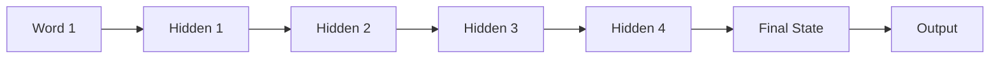
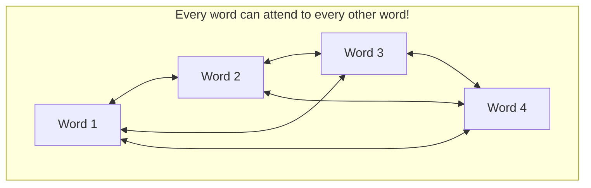
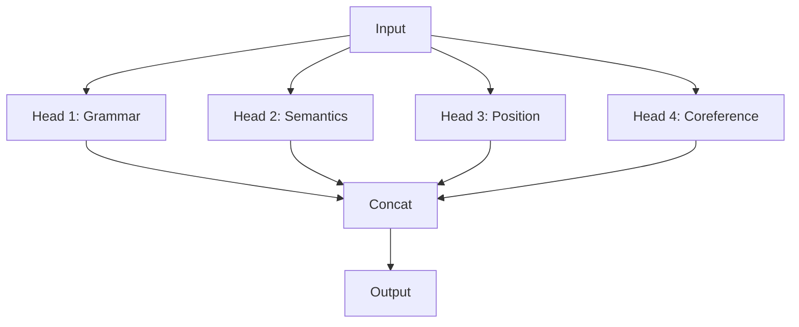

# 👀 Workshop 4: Attention Mechanism

## The Magical Spotlight That Changed Everything

*GenAI Self-Build Workshop Series (4 of 6)*

---

# 📋 What You'll Learn Today

1. **What is attention?** And why it revolutionized AI
2. **Query, Key, Value** - The three pillars
3. **Scaling** - Why √d matters
4. **Multi-head attention** - Multiple spotlights
5. **Causal masking** - How GPT prevents cheating

---

# 🛸 The Spotlight Analogy

Imagine our alien is at a **massive concert** with thousands of performers.

Instead of watching everyone equally, the alien has a **magical spotlight** that:

- 🎸 Brightens on the guitarist during a solo
- 🥁 Shifts to the drummer during a fill
- 🎤 Focuses on the singer during vocals

**The spotlight has VARYING INTENSITY** based on relevance!

---

# 🎯 This Is What Attention Does

| Concert | Language Model |
|---------|----------------|
| Spotlight | Attention weights |
| Performers | Words in sentence |
| What to watch | What's relevant |
| Intensity | Weight value (0-1) |

> **Attention = learned relevance weighting**

---

# 📊 Before Attention: The RNN Bottleneck



**Problems:**
- ❌ Sequential (slow on GPUs)
- ❌ Long-range dependencies lost
- ❌ Fixed-size bottleneck

---

# ✨ With Attention: Direct Access



**Benefits:**
- ✅ Parallel computation
- ✅ Direct long-range access
- ✅ Learnable relationships

---

# 🔑 Query, Key, Value

Think of it like **searching a library**:

| Component | Library Analogy | What It Does |
|-----------|-----------------|--------------|
| **Query (Q)** | Your search term | "What am I looking for?" |
| **Key (K)** | Book titles/tags | "What does each item contain?" |
| **Value (V)** | Book contents | "What information to retrieve?" |

---

# 📐 The Attention Formula

$$\text{Attention}(Q, K, V) = \text{softmax}\left(\frac{QK^T}{\sqrt{d_k}}\right)V$$

Let's break this down step by step...

---

# Step 1: Compute Scores

```python
# Q: (seq_len, dim) - What we're looking for
# K: (seq_len, dim) - What each position has

scores = Q @ K.T  # (seq_len, seq_len)
```

**Result:** A matrix where `scores[i][j]` = how much position `i` matches position `j`

---

# Step 2: Scale the Scores

```python
# Without scaling: scores can be HUGE (proportional to dim)
# With scaling: keep values reasonable

d_k = Q.shape[-1]  # dimension
scaled_scores = scores / np.sqrt(d_k)
```

**Why √d?** Keeps variance ~1, prevents softmax from becoming one-hot

---

# Step 3: Apply Softmax

```python
# Convert scores to probabilities
# Each row sums to 1

weights = softmax(scaled_scores)  # (seq_len, seq_len)
```

**Result:** `weights[i][j]` = probability that position `i` attends to position `j`

---

# Step 4: Weighted Sum of Values

```python
# V: (seq_len, dim) - The actual content

output = weights @ V  # (seq_len, dim)
```

**Result:** Each position gets a weighted combination of all values, based on relevance!

---

# 🖼️ Visualizing Attention

```
"The cat sat on the mat"

         The  cat  sat  on  the  mat
The     [0.3, 0.1, 0.1, 0.1, 0.3, 0.1]
cat     [0.1, 0.4, 0.1, 0.0, 0.1, 0.3]
sat     [0.2, 0.3, 0.2, 0.1, 0.1, 0.1]
on      [0.1, 0.1, 0.2, 0.3, 0.1, 0.2]
the     [0.3, 0.1, 0.1, 0.1, 0.3, 0.1]
mat     [0.1, 0.3, 0.1, 0.2, 0.1, 0.2]
```

Each row shows what that word "pays attention to"

---

# ⚠️ Why Scaling Matters

Without scaling (dim=64):

```
scores = Q @ K.T        # Values range: -64 to +64
softmax(scores)         # [0.0001, 0.0001, 0.9998, 0.0001]
                        # Nearly one-hot! Bad gradients!
```

With scaling:

```
scores = (Q @ K.T) / 8  # Values range: -8 to +8
softmax(scores)         # [0.1, 0.2, 0.4, 0.3]
                        # Smooth distribution! Good gradients!
```

---

# 🧠 Multi-Head Attention

**Problem:** One attention head can only capture ONE type of relationship.

**Solution:** Use MULTIPLE heads, each learning different patterns!



---

# 👁️ What Heads Learn

| Head | Might Capture |
|------|---------------|
| Head 1 | Subject-verb agreement |
| Head 2 | Pronoun resolution ("it" → "cat") |
| Head 3 | Adjacent word relationships |
| Head 4 | Punctuation patterns |

Each head = a different "spotlight" looking for different things!

---

# 🎭 Causal Masking (GPT-style)

**For text generation:** Each word can only see PREVIOUS words!

```
Position 0: [✓, ✗, ✗, ✗]  - Sees only itself
Position 1: [✓, ✓, ✗, ✗]  - Sees 0, 1
Position 2: [✓, ✓, ✓, ✗]  - Sees 0, 1, 2
Position 3: [✓, ✓, ✓, ✓]  - Sees all
```

**Why?** Model can't "cheat" by looking at future tokens!

---

# 🔧 Implementing Causal Mask

```python
def create_causal_mask(seq_len):
    # Upper triangle = -infinity
    mask = np.triu(np.ones((seq_len, seq_len)), k=1)
    mask[mask == 1] = -np.inf
    return mask

# Apply before softmax:
scores = scores + mask  # -inf positions become 0 after softmax
```

---

# 🆚 BERT vs GPT

| Aspect | BERT | GPT |
|--------|------|-----|
| **Masking** | Bidirectional | Causal |
| **Sees** | All positions | Only past |
| **Training** | Fill in [MASK] | Predict next |
| **Use Case** | Understanding | Generation |
| **Example** | Sentiment analysis | ChatGPT |

---

# 💻 Live Demo Time!

Let's explore attention in our Streamlit app:

1. **Interactive sentence attention**
2. **Compare attention types**
3. **Visualize causal masking**
4. **Multi-head patterns**

```bash
streamlit run app.py
```

---

# 🔗 Where Attention Lives in GPT

```
GPT Architecture:
├── Token Embedding
├── Position Embedding
├── Transformer Block (×96 in GPT-3)
│   ├── 👉 Multi-Head Self-Attention (causal)
│   ├── Layer Norm
│   ├── Feed-Forward Network
│   └── Layer Norm
└── Output Projection
```

Attention is the CORE of every transformer!

---

# 📊 Scale Comparison

| | Our Demo | GPT-3 |
|--|----------|-------|
| Embedding dim | 64 | 12,288 |
| Num heads | 4 | 96 |
| Head dim | 16 | 128 |
| Layers | 1 | 96 |
| Parameters | ~16K | 175B |

Same concepts, different scale!

---

# 🎯 Key Takeaways

1. **Attention = learned relevance weighting**
   - Every position can "look at" every other position

2. **Q, K, V = search, match, retrieve**
   - Query asks, Key matches, Value returns

3. **Scaling by √d = gradient stability**
   - Prevents softmax from becoming one-hot

4. **Multi-head = multiple relationship types**
   - Grammar, semantics, position, coreference

5. **Causal masking = no cheating**
   - Essential for text generation

---

# ➡️ Next Workshop: Transformers!

We'll put it ALL together:

- ✅ Tokenization (Workshop 1)
- ✅ Embeddings (Workshop 2)
- ✅ Vector Search (Workshop 3)
- ✅ **Attention** (Workshop 4)
- 🔲 Feed-Forward + LayerNorm + Residuals
- 🔲 Complete Transformer Block

**Build a mini-GPT from scratch!**

---

# ❓ Q&A Time

## Questions?

### Resources:
- 📄 "Attention Is All You Need" (2017)
- 🎨 The Illustrated Transformer (Jay Alammar)
- 📺 3Blue1Brown: Attention in Transformers

---

# 🙏 Thank You!

## Workshop 4 of 6: Attention Mechanism

**Code:** `workshops/04-attention/`

**Run demo:** `streamlit run app.py`

*See you at Workshop 5: Transformers!*
