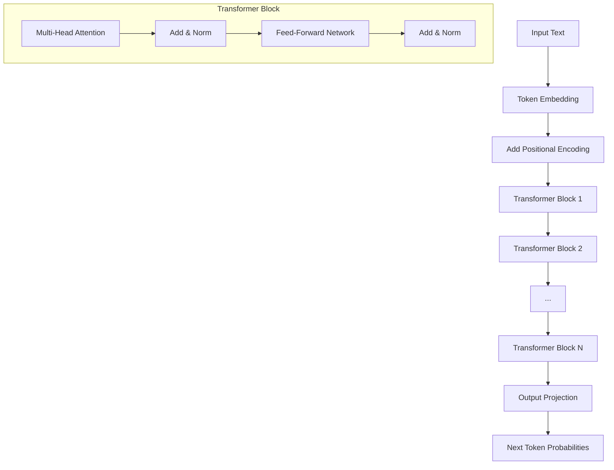

# 🧠 Workshop 5: Transformers — The Alien's Complete Brain

## 🛸 The Factory Analogy

Imagine our alien has evolved from just having a spotlight (attention) to building a 
**complete language processing factory**. This factory has multiple stations:

1. **📦 Receiving Dock** — Words arrive and are converted to number vectors (embeddings)
2. **📍 Stamping Station** — Each item gets a position marker (positional encoding)
3. **👀 Quality Control Teams** — Multiple inspection teams examine relationships (multi-head attention)
4. **🔧 Processing Plant** — Information is transformed and refined (feed-forward network)
5. **🔄 Assembly Line** — The process repeats through multiple layers

THIS IS EXACTLY WHAT A TRANSFORMER DOES. It's a factory that processes language 
through multiple stages, each building on the previous, until it can predict what 
word comes next.

---

## 📋 What You'll Learn

- Understand the complete transformer architecture
- Build a minimal decoder-only transformer (GPT-style)
- See how attention, feed-forward, and normalization work together
- Generate text token by token

---

## 🏗️ Architecture



---

## Session Outline

| Time | Activity |
|------|----------|
| 0-5 min | Hook: Generate text with tiny model |
| 5-20 min | Theory: Transformer architecture |
| 20-45 min | Build: Mini-GPT step by step |
| 45-60 min | Q&A and wrap-up |

---

## Key Concepts

### Transformer Variants

| Type | Example | Use Case | Attention |
|------|---------|----------|-----------|
| **Encoder-only** | BERT | Understanding, classification | Bidirectional |
| **Decoder-only** | GPT, Claude | Text generation | Causal (masked) |
| **Encoder-Decoder** | T5, BART | Translation, summarization | Both |

### Key Components

1. **Positional Encoding** — Sine/cosine waves that mark word positions
2. **Multi-Head Attention** — Multiple parallel attention mechanisms
3. **Feed-Forward Network** — Per-position MLP with GELU activation
4. **Layer Normalization** — Stabilize activations for training
5. **Residual Connections** — Skip connections that preserve information

### Why Transformers Work

- ⚡ **Parallel processing** — All tokens processed simultaneously (fast on GPUs)
- 🔗 **Direct connections** — Any token can attend to any other in O(1)
- 📊 **No vanishing gradients** — Residual connections help gradients flow
- 🎯 **Flexible context** — Learned attention vs. fixed windows

---

## 📁 Files

| File | Description |
|------|-------------|
| [transformer.py](transformer.py) | Complete MiniTransformer implementation |
| [app.py](app.py) | Interactive Streamlit demo |
| [test_transformer.py](test_transformer.py) | Test suite (25 tests) |
| [cheatsheet.md](cheatsheet.md) | Quick reference guide |
| [qna.md](qna.md) | Anticipated questions and answers |
| [slides/](slides/) | Presentation slides |

---

## 🚀 Quick Start

```bash
# Install dependencies
pip install -r requirements.txt

# Run the interactive demo
streamlit run app.py

# Run tests
python test_transformer.py

# Run the main demo
python transformer.py
```

---

## 💻 Code Example

```python
from transformer import MiniTransformer, SimpleVocab

# Initialize
vocab = SimpleVocab()
model = MiniTransformer(
    vocab_size=vocab.vocab_size,
    embed_dim=64,
    num_heads=4,
    num_layers=2
)

# Generate text
prompt = "the cat sat on"
token_ids = vocab.encode(prompt)
generated = model.generate(token_ids, max_new_tokens=5)
print(vocab.decode(generated))
```

---

## 🔗 Connection to LLMs

Our MiniTransformer is architecturally identical to GPT — just much smaller:

| Aspect | Our Demo | GPT-3 | GPT-4 |
|--------|----------|-------|-------|
| Parameters | ~100K | 175B | ~1.8T |
| Layers | 2 | 96 | 120+ |
| Attention Heads | 4 | 96 | 128+ |
| Training Data | None | 500B tokens | Trillions |

The same principles scale up: attention finds patterns, feed-forward processes, 
residuals preserve information, and stacking builds abstraction.

---

## 🔗 Workshop Connections

- **← Workshop 4 (Attention):** We used attention as a building block
- **← Workshop 2 (Embeddings):** Token embeddings are the input
- **← Workshop 1 (Tokenization):** Tokens are what we embed and process
- **→ Workshop 6 (RAG):** Combine transformers with external knowledge retrieval

---

## ➡️ Next Workshop

**Workshop 6: RAG (Retrieval-Augmented Generation)**
- Combine our transformer with a vector database
- Give the model access to external knowledge
- Build a simple question-answering system

---

## Take-Home Exercise

1. Experiment with different temperatures (0.5 vs 2.0) — how does output change?
2. Try different numbers of layers and heads — what's the effect?
3. Add new words to SimpleVocab and see how generation changes
