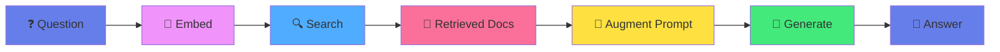

<!-- _class: lead -->

# 🔍 Workshop 6: RAG
## Retrieval-Augmented Generation

### *Give the alien a search engine!*

**The Grand Finale of GenAI Self-Build**

---

# 🎯 Learning Objectives

By the end of this workshop, you'll understand:

1. **Why RAG exists** - Solving LLM limitations
2. **How retrieval works** - Vector search for relevant docs
3. **Prompt augmentation** - Injecting context intelligently
4. **The complete pipeline** - Putting all workshops together

---

# 🛸 The Search Engine Analogy

Our alien's brain (the transformer) has a problem:

- 📚 Only knows what it learned in "school" (training)
- 📅 Can't access new information after training cutoff
- 🤥 Might confidently make things up (hallucination)!

**Solution:** Give the alien a library card! 📚🔍

---

# 🔍 What is RAG?

**R**etrieval - **A**ugmented - **G**eneration

```
┌─────────────┐     ┌─────────────┐     ┌─────────────┐
│  Retrieval  │ ──▶ │  Augmented  │ ──▶ │ Generation  │
│  Find docs  │     │ Add to prompt│     │  Answer!    │
└─────────────┘     └─────────────┘     └─────────────┘
```

Instead of asking the alien to **remember** everything,
we give it a **search engine** to find information first!

---

# 📖 Open Book vs Closed Book

| Closed Book (Standard LLM) | Open Book (RAG) |
|---------------------------|-----------------|
| Must memorize everything | Can look things up |
| Knowledge gets stale | Always current |
| Can't cite sources | Sources included |
| May hallucinate | Grounded in docs |

**RAG is like giving students an open-book exam!**

---

# 🏗️ The RAG Pipeline



---

# Step 1: Embed the Question 🔢

Convert the question into a vector (using what we learned in Workshop 2!)

```python
embedder = SimpleEmbedder(embed_dim=64)
query_vector = embedder.embed("What is Python?")
# → [0.23, -0.45, 0.12, ...]
```

This vector represents the **meaning** of the question.

---

# Step 2: Search the Knowledge Base 🔍

Find documents similar to the query (Workshop 3!)

```python
store = DocumentStore(embedder)
store.add_documents(texts=["Python is...", "Java is..."])

results = store.search("What is Python?", top_k=3)
# Returns top 3 most similar documents
```

Uses **cosine similarity** to find semantically similar docs.

---

# Step 3: Augment the Prompt 📝

Inject retrieved context into the prompt:

```text
Answer based on the provided context.

Context:
[Source: docs/python.md]
Python is a high-level programming language known for 
its readability and versatility...

Question: What is Python?

Answer:
```

---

# Step 4: Generate the Answer 💬

The LLM reads the augmented prompt and generates:

```text
Python is a high-level programming language known for 
its readability and versatility. [Source: docs/python.md]
```

✅ **Grounded** in retrieved documents
✅ **Cites** the source
✅ **Current** information (from knowledge base)

---

# 🐍 The Code: SimpleEmbedder

```python
class SimpleEmbedder:
    """Convert text to vectors."""
    
    def __init__(self, embed_dim=64):
        self.embed_dim = embed_dim
        self.word_vectors = {}  # Cache for consistency
    
    def embed(self, text: str) -> np.ndarray:
        # Tokenize → get word vectors → combine
        words = text.lower().split()
        vectors = [self._get_word_vector(w) for w in words]
        return normalize(np.mean(vectors, axis=0))
```

---

# 🐍 The Code: DocumentStore

```python
class DocumentStore:
    """Vector database for documents."""
    
    def add_documents(self, texts, sources):
        for text, source in zip(texts, sources):
            embedding = self.embedder.embed(text)
            self.documents.append({
                'text': text,
                'embedding': embedding,
                'metadata': {'source': source}
            })
    
    def search(self, query, top_k=3):
        # Compare query to all docs, return top matches
```

---

# 🐍 The Code: RAGPipeline

```python
class RAGPipeline:
    """Complete RAG system."""
    
    def query(self, question):
        # 1. Retrieve relevant docs
        docs = self.doc_store.search(question, self.top_k)
        
        # 2. Build augmented prompt
        prompt, sources = self.prompt_builder.build_prompt_with_sources(
            question, docs
        )
        
        # 3. Generate answer
        answer = self.generator.generate(prompt)
        
        return {'answer': answer, 'sources': sources}
```

---

# 🎮 Live Demo Time!

Let's explore RAG interactively:

1. **Ask questions** - See retrieval + generation
2. **Trace the pipeline** - Watch each step
3. **Explore the knowledge base** - Browse documents
4. **Add custom documents** - Extend the system

```bash
streamlit run app.py
```

---

# 🤔 Why Not Just Use Long Context?

"Can't we just put ALL documents in the prompt?"

| Long Context | RAG |
|--------------|-----|
| Simple | More complex |
| Limited to ~200K tokens | Unlimited scale |
| Slow (process everything) | Fast (only relevant) |
| Expensive (all tokens) | Cheap (selected tokens) |

**RAG scales to millions of documents!**

---

# 🔗 How RAG Uses All 6 Workshops

| Workshop | Component | Role in RAG |
|----------|-----------|-------------|
| 1. Tokenization | Text → Tokens | Process text |
| 2. Embeddings | Tokens → Vectors | Encode meaning |
| 3. Vector DB | Store & Search | Find similar docs |
| 4. Attention | Focus | (Inside transformer) |
| 5. Transformer | Sequence → Sequence | Generate answers |
| **6. RAG** | **Full Pipeline** | **Combine all!** |

---

# 🌍 RAG in the Real World

**Perplexity AI** - Search + answer with sources
**ChatGPT** - Browsing, file upload, custom GPTs
**GitHub Copilot** - Code + documentation context
**Enterprise AI** - Query internal documents
**Customer Support** - Answer from knowledge bases

You now understand how all of these work!

---

# ⚠️ RAG Challenges

1. **Retrieval Quality** - Bad search = bad answers
2. **Chunk Size** - Too big or small affects results
3. **Context Window** - Still limited by prompt size
4. **Contradictions** - What if sources disagree?
5. **Security** - Don't leak sensitive documents

---

# 📊 Key Takeaways

1. **RAG = Search + Generate**
   - Find relevant docs, add to prompt, answer

2. **Solves three LLM problems**
   - Hallucination, staleness, no citations

3. **Combines all workshop concepts**
   - Tokenization → Embeddings → VectorDB → Attention → Transformers → RAG

---

<!-- _class: lead -->

# 🎉 Congratulations!

You've completed the **GenAI Self-Build Workshop Series!**

You now understand the core components that power modern AI:
- How text becomes numbers
- How meaning becomes vectors
- How we find similar things
- How models focus attention
- How transformers process language
- How RAG grounds generation

**You've demystified GenAI! 🛸**

---

# 📚 Series Recap

| # | Workshop | Core Analogy |
|---|----------|--------------|
| 1 | Tokenization | 🛸 Alien builds a codebook |
| 2 | Embeddings | 🗺️ Alien creates a meaning map |
| 3 | Vector DB | 📚 Alien's magic library |
| 4 | Attention | 👀 Alien's spotlight of focus |
| 5 | Transformers | 🧠 Alien's complete brain |
| 6 | RAG | 🔍 Alien's search engine |

---

<!-- _class: lead -->

# ❓ Q&A Time

**15 minutes for questions**

Resources:
- 📁 `workshops/06-rag/` - All code and materials
- 📖 `qna.md` - Common questions answered
- 📋 `cheatsheet.md` - Quick reference

---

# 🚀 What's Next?

Now that you understand the fundamentals:

1. **Experiment** - Modify the code, break things, learn
2. **Scale Up** - Try real embeddings (OpenAI, Cohere)
3. **Build** - Create your own RAG application
4. **Share** - Teach someone else!

**The best way to learn is to build. Keep building! 🔧**

---

<!-- _class: lead -->

# Thank You!

## 🛸 You've Demystified GenAI!

*From tokenization to transformers to RAG,
you now understand how modern AI really works.*

**Keep exploring, keep building, keep learning!**
